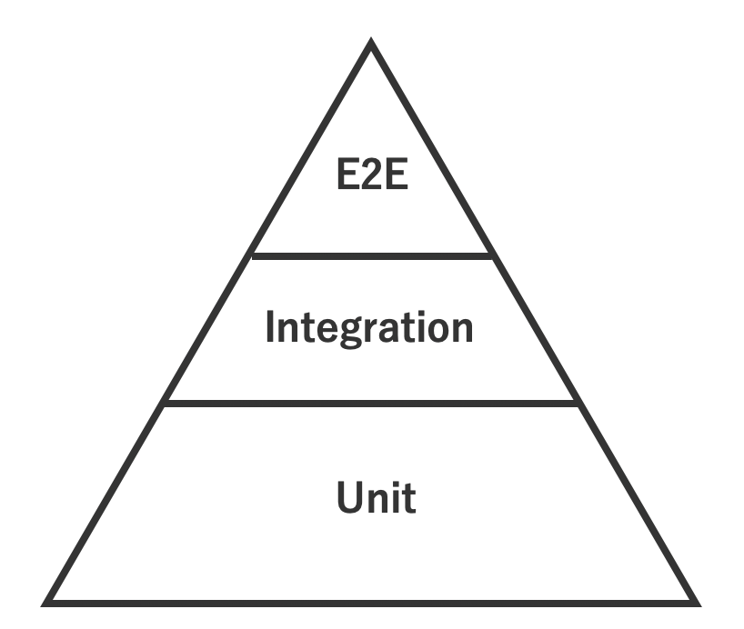

こんにちは、株式会社アカツキでインターンしている  です。

今回は、ゲーム内仮想通貨管理サービスの設計改善を行った上で分かった、コードの可読性やテスタビリティを向上させる設計方法や、実際の作業を行う上で苦労したポイントを紹介します。

<!--more-->

## ゲーム内仮想通貨管理サービスとは

アカツキでは、課金・決済といった各ソーシャルゲームが個々で作るのが大変な機能をサービスとして切り出し、API として機能を提供しています。
このサービスにより、ゲーム開発者は **「ゲームを開発する」** いう本質的な作業に注力できるようになっています。誤解のないように明記しておきますが、ここで言う「仮想通貨」は Bitcoin などに代表される暗号通貨ではなく、ゲーム内の通貨という意味です。

## 設計改善を行うまでの経緯

今回の移行を行うことになった発端はライブラリ移行でした。

このサービスは GAE 上で動いていて、データベースには datastore が使われています。datastore へのアクセスには自動キャッシュをしていくれるというライブラリを使っているのですが、これを使っているせいで微妙な実装になっている部分がありました。その流れで、使用するライブラリをに移行しようという話になり、自分が担当することになりました。

## 現状の課題

実際にライブラリを移行するにあたって既存のコードを読み進めたのですが、大きく 2 つの問題がありました。

### ドメインロジックと datastore へのアクセス処理が密結合になっている

１つ目はドメインロジックと datastore へのアクセス処理が密結合になっているという問題です。この時の実装では、 `domain` パッケージの中に、実際のドメインロジックと datastore へのアクセス処理が両方書かれていました。インターフェースを用いた抽象化もされておらず、手続き的にコードが書かれていました。そのため、一つ一つの関数の行数が多く、初めて読んだときは少し読みづらいと感じました。

### ユニットテストが少なく、インテグレーションテストが多い

2 つ目はユニットテストが少なく、インテグレーションテストが多いという問題です。上で述べた通り、密結合になっているせいで、ユニットテストが書きづらく、結果としてインテグレーションテストが多くなっているように見えました。また、インテグレーションを行っているためそれなりのカバレッジが出ているのですが、実際はテストパターンをきちんと網羅できていないように思えました。

また、「自動テストはユニットテストを多く、インテグレーションテストは少なくするべき」という test automation pyramid の考え方に則っておらず、変更に弱いです。

_test automation pyramid_

## 設計改善

現状の課題を考えると、このままライブラリを移行しようとすると **今まで以上に複雑度が増してしまう可能性** ありました。メンターさんと相談した結果、まずは datastore へのアクセスを抽象化し、ドメインのロジックと分離してから、ライブラリの移行を行うことにしました。

具体的には、永続化処理を `Respository` インターフェースとして定義し、それを実装する構造体に今までの datastore へのアクセス処理を移行しました。DIP で依存関係が逆転することで、 `domain` パッケージでは永続化の詳細を知る必要なくコードが書けることができるようになりました。

最終的には数千行のコードを変更し、リポジトリ全体の 2 割程度を変更して作業は終了しました。

## 設計改善で得られたメリット

今回の設計改善を行うことで、先に述べた 2 つの課題は解決できました。

### 疎結合な設計にすることができた

密結合になっている問題は、インターフェースを使うことで、疎結合な設計にすることができました。

### テスタビリティを向上させることができた

永続化処理をインターフェースとして定義することでモックを流し込めるようになり、ユニットテストがとても書きやすくなりました。今までのテストコードはビジネスロジックのテストをするためだけに事前に datastore にデータを流し込んだりしていましたが、モックのおかげでその必要はなくなり、返り値を宣言するだけでよくなりました。


t.Parallel()

tests := []struct {
name string
hoge *types.Hoge
injector func(*mocks.MockHogeRepository) *mocks.MockHogeRepository
want *types.Hoge
wantErr bool
}{
{
name: "return error when post failed",
hoge: &types.Hoge{
HogeID: "invalid",
},
injector: func(r *mocks.MockHogeRepository) *mocks.MockHogeRepository {
r.EXPECT().Post(gomock.Any(), types.Hoge{HogeID: "invalid"}).
Return(nil, errors.New("some error"))
return r
},
want: nil,
wantErr: true,
},
{
name: "should be success",
hoge: &types.Hoge{
HogeID: "hogeID",
},
injector: func(r *mocks.MockHogeRepository) *mocks.MockHogeRepository {
r.EXPECT().Post(gomock.Any(), types.Hoge{HogeID: "hogeID"}).
Return(&types.Hoge{HogeID: "hogeID"}, nil)
return r
},
want: &types.Hoge{
HogeID: "hogeID",
},
wantErr: false,
},
}

for \_, tt := range tests {
t.Run(tt.name, func(t \*testing.T) {
ctrl := gomock.NewController(t)
defer ctrl.Finish()
mockRepo := mocks.NewMockHogeRepository(ctrl)
mockRepo = tt.injector(mockRepo)
// ...
}
}


今の時点ではモックを使ったテストは少ないですが、今後モックを使ったユニットテストが増えていくでしょう。

### コードの可読性が向上した

永続化処理が抽象化され、ドメイン層では宣言的に呼ぶだけでよくなったことにより、コードがすっきりして可読性が向上しました。ひとつひとつの関数の行数が短くなったことで、何をするための関数なのかが分かりやすくなりました。

### 将来的に DB を移行することになったときに移行が楽になる

メンターさんと話しているときに、DB を他の GCP のマネージドサービスに移行したいという話がありました。現時点で移行が決まっているわけでないですが、今回の設計改善により将来の移行時により楽に移行ができると思います。

## 設計改善で妥協した点

### 巨大インテグレーションテストを倒せなかった

基本的にインテグレーションテストは、設計改善のタイミングで複数のユニットテストに分割するようにしていました。

ただ、中には複数のドメインロジックや datastore への永続化を(意図せず)一気にテストするインテグレーションテストが存在しており、これらを倒すのは一筋縄ではいきませんでした。お金を扱うサービスという性質上、複雑になるのは致し方ないことなので、自分のできる範囲で修正していきました。

しかし努力をしたものの、いくつか **「ドメインロジックをテストしているにも関わらず実際の datastore を使うテスト」** 残ってしまいました。ひとまずテスト用のパッケージを作ってテストコードを退避させていますが、あまり適切ではないテストだと思っているので、将来的にはどうにかしなければいけないと思っています。

## 個人的に得られた知見

ここからはポエムです。

### 根拠のある設計は多くのメリットを享受できる

私は以前から Clean Architecture などのアプリケーションレベルのアーキテクチャに興味を持っており、実際に趣味で開発しているコードでも Clean Architecture **ライク** アーキテクチャの導入を検討していました。



<a href="https://www.amazon.co.jp/%E4%B8%96%E7%95%8C%E3%81%A7%E9%97%98%E3%81%86%E3%83%97%E3%83%AD%E3%82%B0%E3%83%A9%E3%83%9F%E3%83%B3%E3%82%B0%E5%8A%9B%E3%82%92%E9%8D%9B%E3%81%88%E3%82%8B%E6%9C%AC-%E3%82%B3%E3%83%BC%E3%83%87%E3%82%A3%E3%83%B3%E3%82%B0%E9%9D%A2%E6%8E%A5189%E5%95%8F%E3%81%A8%E3%81%9D%E3%81%AE%E8%A7%A3%E6%B3%95-Gayle-Laakmann-McDowell/dp/4839960100/ref=as_li_ss_il?__mk_ja_JP=%E3%82%AB%E3%82%BF%E3%82%AB%E3%83%8A&crid=1JS9G2UP6EGVD&keywords=cracking+the+coding+interview&qid=1564644328&s=books&sprefix=Crac,stripbooks,254&sr=1-2&linkCode=li3&tag=plus03b7-22&linkId=b9f2fb658641220d349adc5de977481a&language=ja_JP" target="_blank"></a>

しかし、個人レベルのコードでは嬉しみが見えづらいものなので、 **「ただ冗長な書き方をしているだけでメリットがないのでは？」** 思うようになっていました。

しかし今回のインターンで、 **「メリットを感じられなかったのはなんとなくアーキテクチャを採用していて、根拠を持っていなかったから」** と気づきました。逆に、根拠を持って新たな設計手法を取り入れれば、上で述べたような多くのメリットを享受できます。

世の中にある設計手法はなにかしら目的を持って作られています。多くの場合は既存の開発で感じた辛みをなくすという目的でしょう。その目的が自分の開発しているプロダクトとマッチするかを考えて実装することがとても重要です。

**「開発しているプロダクトに本当に Clean Architecture は必要なのか？本当に求めているのは DIP だけなのでは？」** 考え、プロダクトにあった設計を心がけていきたいです。

## まとめ

今回の設計改善により、明瞭な設計にすることができました。その結果、多くのメリットを享受することができました。もちろんこれが完璧ではなくまだまだ改善の余地がありますが、一定の効果は得られるでしょう。

これでインターンは終わってしまいますが、このインターンで得られた知見を今後に生かしていきたいと思います。最後になりますが、大量の PR をレビューしてくださったメンターさんには感謝しかないです、本当にありがとうございました。

以上、最後までご覧いただきありがとうございました。
