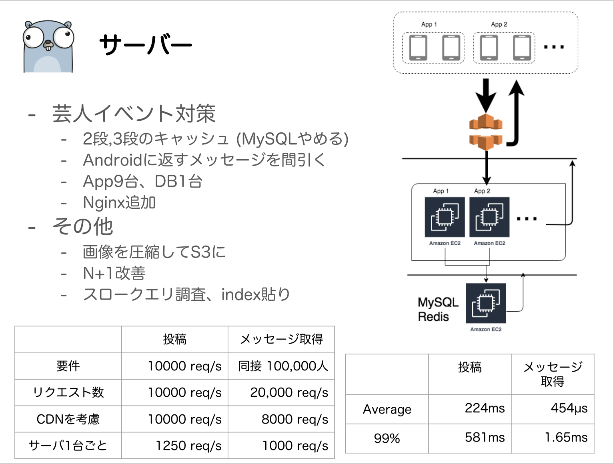

こんにちは、です。  

この度、8月23日~25日に開催されたDeNAのエンジニアサマーインターン プロダクト開発コースにサーバーサイドエンジニアとして参加してきました！

「3日間で最高のアプリに作り直す」というミッションが課せられていたインターンでしたが、最大限の力で最高のアプリに作り直し、**無事優勝することが出来ました🎉**

<blockquote class="twitter-tweet">
DeNA サマーインターン プロダクト開発コースで優勝しました！！！<a href="https://twitter.com/hashtag/dena_summer?src=hash&amp;ref_src=twsrc%5Etfw">#dena_summer</a> <a href="https://t.co/WxI9HxIqzH">pic.twitter.com/WxI9HxIqzH</a>
&mdash; ぷらす (@p1ass) <a href="https://twitter.com/p1ass/status/1165553277435383808?ref_src=twsrc%5Etfw">August 25, 2019</a></blockquote> 

この記事では、インターンに参加した経緯や、インターンの詳しい内容などを紹介していきたいと思います。
来年申し込んでみようかなと考えている人にも役に立ちそうな内容を盛り込んでいるので、是非読んでいってください。

<!--more-->

## プロダクト開発コースとは

DeNAでは様々なサマーインターンを開催していますが、その一つに**「プロダクト開発コース」**というものがあります。

このコースはDeNAが用意した伸びしろのあるアプリ、言い換えれば**クソアプリ**を3日間で良いアプリに作り直すという内容のインターンです。

より詳しい話はDeNAの記事をご覧ください。



## 参加の経緯

実は、去年にも同じDeNAのサマーインターンに申し込んでいました。
当時は**「報酬として10万円貰えるならとりあえず申し込むしかない！」**という軽い気持ちで申し込んでいました。
残念ながら選考は落ちてしまったのですが、かなり悔しくて「来年もう一度チャレンジするぞ」と1年間待ち続けていました。

そんな中、3月の終わり頃にDeNAのインターンの募集が始まっていることに気づき、速攻で申し込みました。
DeNAが公式Twitter等で告知するよりも早くサイトを見つけて応募していたので、申込みはかなり早かった部類だと思います。

<blockquote class="twitter-tweet">
DeNAのサマーインターンの募集始まってるで  【DeNA サマーインターンシップ 2019 募集開始！】 <a href="https://t.co/iwc7gRiMgP">https://t.co/iwc7gRiMgP</a>
&mdash; ぷらす (@p1ass) <a href="https://twitter.com/p1ass/status/1110131164105207808?ref_src=twsrc%5Etfw">March 25, 2019</a></blockquote> 

## 選考について

選考は人によってバラバラでしたが、自分はCTO面接の1回のみでした。

申し込んですぐに「今週末面接どう？」という電話がかかってきて、「今旅行中なんで無理です！」みたいな会話をした記憶があります。

その後予定を調整し、面接終了後にその場で合格をいただけました。
申し込んでから10日で合格が決まったのでかなり爆速でした。
人によっては面接から合格までかなり待ったという話があったので、運が良かったんだと思います。

<blockquote class="twitter-tweet">
インターンの１次面接にCTOが出てくるのは驚きを隠せなかった
&mdash; ぷらす (@p1ass) <a href="https://twitter.com/p1ass/status/1114047882372378624?ref_src=twsrc%5Etfw">April 5, 2019</a></blockquote> 

面接の内容は他でも聞かれるような質問が多かったのですが、「プログラミングを始めたきかっけ」を結構根掘り葉掘り聞かれたのが印象に残っています。

「中学のころにC言語でCUIのテトリスを作ったりして遊んでました」と回答したのですが、「どんなライブラリ使ってたの？」とかを聞かれ、**「7年近く前のことなんか覚えてないよ！」**と思いながら面接してました。

ここで少し後輩に向けてのアドバイスをしておくと、サーバーサイドをやりたいなら

- 何かしらの言語でのAPIを実装
- DB(特にMySQL)
- Docker
- クラウド(AWS or GCP)
- GitHub

あたりはできるようになっておいた方が良いと思います。
これはDeNAに限らず他の会社でも同じです。
これらを使ったWebサービスでも作ったら話すネタにもなるし良いんじゃないかなと思います。

もう少し上を目指すなら

- ミドルウェア(RedisやNginx)
- スケーラビリティを考慮した設計
- OSS貢献

などをすれば良いと思います。

競プロなどのアルゴリズム系はコーディングテストが必要なインターンでは求められますが、DeNAでは必要ありませんでした。

## 事前準備

インターンの1ヶ月前にキックオフイベントがあり、そこでチーム分けなどが発表されました。
クソアプリの仕様は当日まで公開されなかったのですが、「事前にこういうものを勉強してきてほしい」という話があり、事前にある程度調べることにしました。

クライアント側は使用するライブラリ等も細かく指定されていたのですが、サーバーは**「GoでMySQLでCentOSだよ〜(o・∇・o)」**程度の情報量しかありませんでした。
しかし、キックオフイベント後の懇親会で、ISUCON8の問題作成者が今回のインターンの問題作成に関わっているということを聞き、主にパフォーマンスチューニングの方面を重点的に調べることにしました。







調べた内容は全てHackMDにまとめていたのですが、これらはインターンの当日に**とても重宝しました**。
特にDBの調査は今まであまりしたことがなく、何も覚えていなかったので、これがなかったらスムーズに調査することは出来なかったと思います。
やっぱり予習って大事ですね。

## インターン当日

さて、ここからはインターン当日の話です。

### 1日目

<blockquote class="twitter-tweet">
DeNAに来た <a href="https://t.co/Rh7AVai6EX">pic.twitter.com/Rh7AVai6EX</a>
&mdash; ぷらす (@p1ass) <a href="https://twitter.com/p1ass/status/1164696651182641153?ref_src=twsrc%5Etfw">August 23, 2019</a></blockquote> 

まず初めに、インターンのクソアプリが生まれるまでの経緯の紹介(茶番?)がありました。

> 皆さんはDeNAのエンジニアです。とあるチャットアプリの開発チームとして緊急招集されました。
チャットアプリは一度S-inし多くのユーザが一気に利用するようなサービスになりましたが様々な問題により、メンテナンスに入っています。
2日後の夜に大規模なマーケティングが開始されるため遅くとも2日後の14:00までにアプリを更新しなければビジネス上かなりの損失がでてしまいます。
皆さんのエンジニアリング力によりこの危機を乗り越えてください！

なかなか鬼畜な設定ですが、実際はこんなことないらしいです。

まず、実際のアプリの挙動を確認して駄目なところをピックアップしていき、重要度と工数でタスクを分類分けしていって、できるものから取り組んでいくことにしました。

1日目にサーバー側では

- N+1クエリを消す
- 画像がbase64でMySQL内に入っていたので、S3に上げるスクリプトを書く
- GET系のAPIに`limit,offset`クエリパラメータを実装
- MySQLのテーブル、インデックス調査
- Appサーバを8台までスケールアウト
- スロークエリログ調査

を行いました。
途中で**AWSが死ぬ**などのアクシデントがありましたが、落ち着いて自分ができることをこつこつやっていきました。この時点でサーバー側のアプリケーションに仕込まれていたクソ仕様はあらかた片付いたので、明日は新機能も着手できそうという感じでした。

夕食ではお酒を飲みながら寿司を食べました🍣(このタイミングでお酒を飲んでいたのは自分のチームだけだったらしい)

<blockquote class="twitter-tweet">
優勝！！<a href="https://twitter.com/hashtag/dena_summer?src=hash&amp;ref_src=twsrc%5Etfw">#dena_summer</a> <a href="https://t.co/FRdUlRWDPk">pic.twitter.com/FRdUlRWDPk</a>
&mdash; ぷらす (@p1ass) <a href="https://twitter.com/p1ass/status/1164829390598881285?ref_src=twsrc%5Etfw">August 23, 2019</a></blockquote> 

### 2日目

2日目の朝には課題のアップデートがありました。

> 格安スマホの発売を記念しCMに出演中の人気芸人がリアルタイムで質問を受け付ける専門チャンネルを開設します。  
想定されるトラフィックは  
- 1万件発言/秒  
- 10万人の同時接続  

だと公表されました、、、😢

かなり重たい発表だったので、この時点で新機能開発を一旦やめて、リクエストを捌くことに注力することにしました。

まずは、このリクエストを捌くには1台のサーバあたりどれだけの能力が必要かを試算することにしました。
クライアント側のポーリングの間隔やサーバの台数を考慮し、目標数を設定しました。

次にインフラ構成の検討・設計です。  
今回はRDSやElastiCacheを使えず、EC2でDBサーバを動かす必要があるため、DBがスケールしづらいという問題がありました。
そのため、**「ユーザーのリクエストがそのままDBに貫通しないようにする」**という基本的な方針のもと、各レイヤーでキャッシングしていくことにしました。

具体的には、コメントの取得は、

1. コメントのAPIレスポンスをCloudFrontでTTL5秒でキャッシュする
1. Appサーバーのインメモリでコメントのレスポンスをキャッシュする

のようにし、コメントの投稿は、

1. コメントを1/Nの確率でインメモリで保存する
1. 保存されなかったコメントは捨てる

のようにしました。

この実装によりインメモリで持つコメントの内容は各サーバで変わってしまいますが、クライアントは1万コメントを1秒間で表示することは不可能なので、コメントを同期することは諦めました。

しかし、クライアントがポーリングでコメントを取得するとき、LBによって毎回違ったサーバにアクセスしてしまうと、コメントの流れ(擬似的な部屋、ニコ生のアリーナや立ち見でそれぞれできるコメントの流れ)のようなものが失われてしまうと考えました。

そこで、HTTPヘッダーを使って**「あるクライアントは必ずある1つのサーバからコメントを取得する」**ようにしました。
発想としてはクライアントLBに近いと思います。これによりコメントの流れが不自然になることを防ぐことができました。

また、上で説明したキャッシュ戦略を導入したことで、質問チャンネルではMySQLへのアクセスをほとんどなくすことができました。一部各サーバー間で共有する必要があるデータはRedis経由で同期するようにし、こちらも各ユーザのリクエストが直接Redisに行かないように、各Appサーバーでキャッシュするようにしました。

これらの実装が終わったところで実際に負荷テストを行い、ある程度のリクエストを捌けることを確認しました。

<blockquote class="twitter-tweet">
叙々苑の焼肉ランチ <a href="https://twitter.com/hashtag/dena_summer?src=hash&amp;ref_src=twsrc%5Etfw">#dena_summer</a> <a href="https://t.co/H3NcKQPJ7B">pic.twitter.com/H3NcKQPJ7B</a>
&mdash; ぷらす (@p1ass) <a href="https://twitter.com/p1ass/status/1165094579554488321?ref_src=twsrc%5Etfw">August 24, 2019</a></blockquote> 

この日はかなりサーバーサイドのタスクが多く、クライアント向けの実装はあまり出来なかったのですが、クライアントチームはサーバーなしでもできることを着実に進めてくれていました。  
いつの間にかアプリにお絵かき機能が追加されていたときは流石に驚きました🤭

### 3日目

ついに最終日です。

この日は朝イチで、今まで捨てていたコメントを全てRedisに保存する処理を追加しました。

最初は「10,000 req/secをRedisに保存できるのか？」と思っていたのですが、goroutineとチャネルを使ってバルクインサートを実装したことで、要件を満たす速度で保存することができるようになりました。

残りの時間は細かなバグ修正をして開発を終了しました。

## 成果発表会

開発終了後に成果発表会がありました。

サーバーサイドはインフラ構成や計測結果、その他工夫などを簡潔に1枚のスライドにまとめて発表しました。

発表時に少しテンパってしまい、頑張ったところはたくさんあったのですが、あまり紹介することは出来ませんでした😥

発表後の審査員による質問では、**「コメントの編集や削除をできるようにするとキャッシュ戦略は難しいと思うが、その点についてどう思うか」**という趣旨の質問があり、「以外と突っ込んでくるなぁ」と思いつつ、LINEのインターンで得た知識を話したらなんとかなりました。

## 結果発表

 なんと自分のチームが優勝することが出来ました🎉🎉🎉

<blockquote class="twitter-tweet">
DeNA サマーインターン プロダクト開発コースで優勝しました！！！<a href="https://twitter.com/hashtag/dena_summer?src=hash&amp;ref_src=twsrc%5Etfw">#dena_summer</a> <a href="https://t.co/WxI9HxIqzH">pic.twitter.com/WxI9HxIqzH</a>
&mdash; ぷらす (@p1ass) <a href="https://twitter.com/p1ass/status/1165553277435383808?ref_src=twsrc%5Etfw">August 25, 2019</a></blockquote> 

優勝理由を伺ったところ、

- 仕込んだ伸びしろ(クソ)部分をきちんと解決していた
- 独自の新機能を開発していた
- ドキュメントをきちんと書いて情報を共有していた
- 定量的に計測して負荷対策をしていた
- そもそも他のチームよりコードを書いている量が多かった

などを挙げられていました。

確かに他のチームに比べ、SlackのGitHubインテグレーションの通知量が多かったので、沢山の実装を出来たのが優勝につながったのではないかなと思います。また、開発のスピードを上げるために必要なクライアント・サーバ間のコミニュケーションもスムーズだったのも要因の一つだと思います。

## 感想

以下のツイートのように本気で優勝を狙いに来ていたので、優勝できたのは本当に良かったです。

<blockquote class="twitter-tweet">
明日からはDeNAのインターン！ 優勝していい肉食べるぞ！！！🍖
&mdash; ぷらす (@p1ass) <a href="https://twitter.com/p1ass/status/1164527638666330115?ref_src=twsrc%5Etfw">August 22, 2019</a></blockquote> 

また、普段個人で開発しているだけでは他の同年代の学生と相対的に評価される機会が少ないので、このインターンを通してかなり自分に自信がつきました。

今までやってきたことが間違っていなかったと思いつつも、懇親会での社員さんとの会話では「まだまだ足りない」と思う部分も見られたので、今後ももっと沢山の知識を身に着けていきたいと思います。

特にインフラの知識はまだまだ未熟だと思っているので、まずはマスタリングTCP/IPから読みたいと思います💪

## 終わりに

今回のDeNAのサマーインターンでは貴重な経験を詰むことができました。

会社側が3食全て用意してくださり、ホテルもマークシティと近く、快適に開発する環境が整っていました。
報酬も10万と高く、参加しない理由はないと思うので興味を持った方は来年是非申し込んでみてください！

長文お読み頂きありがとうございました。
