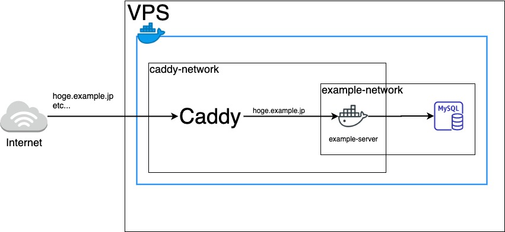

こんにちは、ぷらす()です。

先日、というオンラインのトークイベントで、「複数サービスを運用しやすい理想のコンテナ環境を VPS 上に構築する 」というタイトルで登壇しました。

登壇資料は既にアップロードしていて見られるのですが、端折っている部分の補足をしたいと思います。また、当日頂いた質問についても回答します。

<script async class="speakerdeck-embed" data-id="388f5d3e4da2482ba946db5c2f84d480" data-ratio="1.33333333333333" src="//speakerdeck.com/assets/embed.js"></script>

<!--more-->

## Docker Context を作る際の注意

### `--default-stack-orchestrator`を指定する必要がある

`docker`コマンドを使用しているときは`--default-stack-orchestrator`を指定しなくても動作しますが、`docker-compose`コマンドだとエラーで落ちてしまいます。swarm に繋いているわけではないですが、値を設定しておく必要があります。

```bash
$ docker context create --help
Usage:  docker context create [OPTIONS] CONTEXT
# 中略
Options:
      --default-stack-orchestrator string \\
         Default orchestrator for stack operations \\
         to use with this context (swarm|kubernetes|all)

$ docker context create --default-stack-orchestrator=swarm \\
 --docker "host=ssh://${SSH_USERNAME}@${SSH_IP}:${SSH_PORT}" remote
$ docker context use remote
```

関連 issue : 

### SSH Config が使えない

`ssh`コマンドは`~/.ssh/config` に接続先を書くと、`ssh remote`のように簡潔なコマンドで接続することができます。

Host remote
HostName xx.xx.xx.xx
User user
IdentityFile ~/.ssh/id_rsa


これを使って Docker Context を作成したいと思うところなのですが、この方法は`docker`コマンドでは使えても、`docker-compose`コマンドでは使えません。


$ docker context create --default-stack-orchestrator=swarm \\
 --docker "host=ssh://remote" remote
$ docker context use remote
$ docker --context remote ps # これは動く
$ docker-compose --context remote ps # これはダメ


Docker Compose は外部ライブラリを使って SSH 接続しているのですが、それが対応していないっぽいです。（要検証）

CI で回す際はわざわざ Config に書き込むくらいなら直接設定してしまった方が楽なのであまり問題にならないですが、ローカルで試す際は注意です。

### タイムアウト対策

規模感にもよりますが、大きいイメージをビルドする際にタイムアウトで失敗してしまうことがあります。失敗したときは環境変数でタイムアウトまでの時間を伸ばすとうまくいきます。

```bash
$ export COMPOSE_HTTP_TIMEOUT=600 # デフォルトは60秒
```

## Caddy を使ったユーザリクエストのリバースプロキシ

本題からは少し外れるのですが、登壇後に「複数のサブドメインからのユーザリクエストをどのように処理しているか？」という趣旨の質問があったので回答します。

僕は Caddy という**自動で Let's Encrypt を用いた証明書の更新をやってくれる Go 製の Web サーバ**を使ってリバースプロキシしています。



Caddy は Nginx に比べ設定が容易で、conf に証明書のパスや HTTPS リダイレクトの記述を書く必要がありません。

```bash
hoge.example.jp {
	reverse_proxy /* hoge-server:8080
}

grafana.example.com {
	reverse_proxy /* grafana:3000
}
```

`Caddyfile`というファイルにこのように書くことで、HTTPS の通信の準備が整います。勿論パフォーマンスを求められる環境では Nginx の方が良いと思いますが、今回はそこまでパフォーマンスを求められてないので Caddy を使っています。

現在 v2 の Release Candidate が出ていて、もうすぐメジャーバージョンアップなので、それを待ってから導入するのも手だと思います。僕は既に v2 を使っています。

また、Caddy のコンテナも Docker Context 経由でデプロイしています。  
Caddy からリバースプロキシされるコンテナは `caddy-network` という自分で作成した Docker Network に繋げているので、お互いのコンテナはコンテナ名で名前解決ができるようになっています。
DB など Caddy から直接繋げてはいけないものは `caddy-network` には含めず、アプリケーションサーバとだけ通信できる Network を使って通信しています。



## おわりに

一度デプロイフローを構築すると非常に便利なので、皆さんもやってみましょう！
