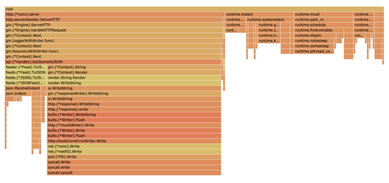

こんにちは、ぷらす([@plus_kyoto](https://twitter.com/plus_kyoto))です。

先日開催されたGo Conference 2019 SpringにWantedlyさんのスカラシップ枠として参加させていただきました！

LINE Developer Day以来、半年ぶりの大きめのカンファレンスだったのですが、Go固有の話をこれだけ聞く機会は今までなかったので、とても有意義な時間を過ごすことができました。

<!--more-->

### スカラシップ枠とは
本題に入る前にスカラシップ枠について少し紹介したいと思います。

Go Conference 2019 Springでは、地方に住む学生のために交通費や宿泊費が援助されるスカラシップ枠が用意されています。今回はWantedlyさんの他に、メルカリさんやメディアドゥさんも用意されていました。



僕は元からGo Conferenceには興味を持っており、自費でも行くつもりだったので、とりあえず申し込んだら受かりました。



### 為になったセッション
#### エラー設計について/Designing Errors

メルカリの[morikuniさん](https://twitter.com/inukirom)によるエラー設計に関するセッションです。



GoはJavaなど他の言語に実装されている例外がありません。すべてのエラーは戻り値によって返し、そのエラーハンドリングは各実装者に任されています。そのため、人によってエラーハンドリングの設計が異なり、ベストプラクティスがはっきりとしていませんでした。

僕がGoでなにかを実装するときは、**「`pkg/errors`でとりあえず`Wrap`しとく」**くらいの適当な感じで行っていたのですが、このセッションを聞いたことでしっかりとしたエラー設計ができそうに思えました。

特に「関係者によってエラーに求める情報が異なる」という点について今まで考えたことがなく、各関係者がそれぞれ欲している情報を適切にエラーに含めることができるような設計を心がけるべきだと感じました。

また、morikuniさんが作られた`morikuni/failure`とGo1.13から正式に実装される予定の`xerrors`の違いに関する話もされており、用途に応じて適切なpackageを使っていきたいです。



#### Goによる外部プロセス起動ベストプラクティス及びtimeoutパッケージ徹底解決
こちらは[songmuさん](https://twitter.com/songmu)によるセッションです。Go界隈では有名な方ですね。



簡単なCLIアプリケーションなら作れるのですが、外部プロセスを扱う方法を理解していなかったので、セッションを聞きに行きました。

プロセスのシグナル周りを丁寧に解説されており、`exec.CommandContext`ではSIGKILLが送られてしまうので孫プロセスを止められない、といった標準packageのデメリットなども紹介されていました。

また、コマンドの出力に`golang.org/x/text/transform`の`Transformer`を使ってタイムスタンプをつけるテクニックは他にも色々な用途で使えそうだと思いました。
`io.Reader`を使えるので汎用性が高い点も良いです。

#### Expand observability in Go
Google CloudでDeveloper Advocateをされている[ymotongpooさん](https://twitter.com/ymotongpoo)のパフォーマンスチューニングに関するセッションです。**個人的に今回のGo Conferenceで一番良かったセッションでした。**



学生が趣味レベルでコードを書く場合、パフォーマンスチューニングを行うほどの性能を求められることはほとんどありません。そのため、`net/http/pprof`や`net/http/httptrace`は名前を聞いただけでほとんど実践したことがありませんでした。

このセッションでは、サンプルコードを例にパフォーマンスチューニングのやり方を丁寧に解説されていました。

> Process for Performance Tuning  
> 1. Collect as many metrics as possible  
> 2. Dig into the repeat and specify the roote cause  
> 3. Write and benchmark  
> 4. Modify the implementation  
> 5. Repeat 3 & 4 until the benchmark result get improved  

Goでは↑の各ステップを行うための様々なツールが用意されており、それらを使えば簡単に計測を行える点がとても魅力的に感じました。

**実際にやってみた**

翌日、自分が建てているAPIサーバに対して実際にProfileを取ってみました。
このAPIサーバーはginを使って建てていたので、pprofの設定は[`gin-contrib/pprof`](https://github.com/gin-contrib/pprof)で行いました。

APIサーバーに対する負荷はGo製の負荷テストツールである[`tsenart/vegeta`](https://github.com/tsenart/vegeta)を使って行い、秒間100リクエストを10秒間与え、その間の5秒をpprpfで計測しました。


echo "GET  http://localhost:8080/json" | vegeta attack -rate=100  -duration=10s | tee result.bin



go tool pprof -http=":8888" http://localhost:8080/debug/pprof/profile 


結果は以下のようになりました。

_pprofのFrame Graph_

メモリに保持しているデータをJSONにシリアライズして返すだけの単純なAPIなので、`runtime`や`net/http`が支配的で、問題になりそうな部分は見当たりませんでした。

これがISUCONの参考実装であれば、明確に遅い部分が見つかると思うので、今後試していきたいです。

### 終わりに
僕はGoをほとんど独学で勉強してきましたが、Go Conferenceはまだ知らないことを知るとても良い機会でした。
日本で一番大きなGoに関するカンファレンスということもあり、レベルの高い話が多く、Gopherなら絶対に行くべきイベントだと思います。

来年は自分が登壇する側に回れるように頑張りたいです💪

最後になりますが、このような機会を設けてくださったWantedlyさん本当にありがとうございました！

### おまけ

<blockquote class="twitter-tweet">
問題付きのコーヒーカップ <a href="https://twitter.com/hashtag/gocon?src=hash&amp;ref_src=twsrc%5Etfw">#gocon</a> <a href="https://t.co/rDLyJxzADr">pic.twitter.com/rDLyJxzADr</a>
&mdash; ぷらす (@plus_kyoto) <a href="https://twitter.com/plus_kyoto/status/1129568723424096256?ref_src=twsrc%5Etfw">May 18, 2019</a></blockquote> 

<blockquote class="twitter-tweet">
gopher君チロルチョコ <a href="https://twitter.com/hashtag/gocon?src=hash&amp;ref_src=twsrc%5Etfw">#gocon</a> <a href="https://t.co/5YgzdscJkl">pic.twitter.com/5YgzdscJkl</a>
&mdash; ぷらす (@plus_kyoto) <a href="https://twitter.com/plus_kyoto/status/1129581700835504128?ref_src=twsrc%5Etfw">May 18, 2019</a></blockquote> 

メルカリのスカラシップで来ていた人のうち、2人が元からTwitterのFFでした。世間は狭いですね。

<blockquote class="twitter-tweet">
TLにメルのスカラシップの人が2,3人いそうな気配がする
&mdash; ぷらす (@plus_kyoto) <a href="https://twitter.com/plus_kyoto/status/1129532777244741632?ref_src=twsrc%5Etfw">May 17, 2019</a></blockquote> 

おわり
