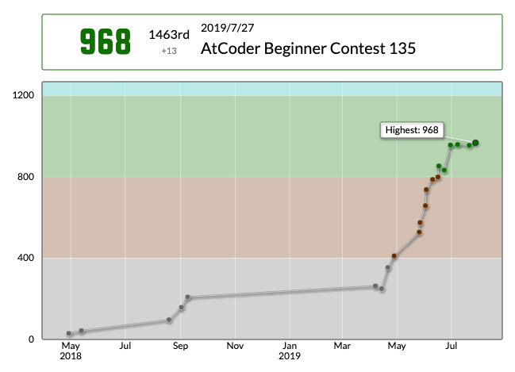

こんにちは、です。

タイトルの通りですが、Google のインターンに落ちました。

インターンに申し込むと決めるまで競プロすらまともにやったことがなかったのですが、一次選考のオンラインのコーディングテストを突破し、Phone Interview までたどり着くことができました。

残念ながら Phone Interview は不合格となってしまいましたが、それまでの勉強で多くのこと(特にデータ構造とアルゴリズム)を学ぶことができました。

この記事では、Google のインターンに申し込むにあたってどのようなことを勉強したかなどについて共有したいと思います。

<!--more-->

## Google のインターンに申し込んだ経緯

始めて Google と接点が持ったのは、京大卒の Google エンジニアとの交流会でした。

<blockquote class="twitter-tweet" data-partner="tweetdeck">
4月に京大で、京大出身Googleエンジニアと京大生の交流会を開きます。ChromeやAndroidから僕、Google Assistantから先輩がもう一人来ますのでぜひ！普段なかなか表に出ない弊社の面接の内容とかも伝授します！応募は  <a href="https://t.co/7ODjK4xG2i">https://t.co/7ODjK4xG2i</a> から。 <a href="https://t.co/ycmMrFEH9G">pic.twitter.com/ycmMrFEH9G</a>
&mdash; [  takise  ] (@takisejr) <a href="https://twitter.com/takisejr/status/1104532614566699008?ref_src=twsrc%5Etfw">March 10, 2019</a></blockquote>

交流会では、Google での働き方などを知ることができ、模擬コーディングインタビューも見ることができました。

来ていたエンジニアの方が**「CS 専攻ではない学部生でもインターンに申し込んでも大丈夫」**という趣旨の発言をされていたので、記念受験的な意味も込めてインターンに申し込むことにしました。

## コーディングテスト対策

Google のインターンの選考を突破するにはデータ構造とアルゴリズムの知識が必要です。

しかし、私は CS 系の学科ではないので、データ構造とアルゴリズムを大学の講義で学んだことはなく、申し込み時点での Atcoder のレートは灰色でした。

流石にこのレベルではマズイと思い、書籍ベースでの学習とオンラインジャッジしてくれるサイトを併用して対策することにしました。

### データ構造とアルゴリズム 杉原 厚吉



4 月から丁度、大学のデータ構造とアルゴリズムの講義を受けるすることができたので、その講義で使われている教科書を一気読みしました。

文章はとても読みやすく、すんなりと読むことが出来ました。(普段読んでる電気電子の本が読みづらいのもありますが。)

また、書かれているデータ構造やアルゴリズムはすべて Go で実装を行い、性質の理解だけでなくフルスクラッチで実装できるようにしていきました。

### Cracking the Coding Interview

{{< block-link href="https://www.amazon.co.jp/%E4%B8%96%E7%95%8C%E3%81%A7%E9%97%98%E3%81%86%E3%83%97%E3%83%AD%E3%82%B0%E3%83%A9%E3%83%9F%E3%83%B3%E3%82%B0%E5%8A%9B%E3%82%92%E9%8D%9B%E3%81%88%E3%82%8B%E6%9C%AC-%E3%82%B3%E3%83%BC%E3%83%87%E3%82%A3%E3%83%B3%E3%82%B0%E9%9D%A2%E6%8E%A5189%E5%95%8F%E3%81%A8%E3%81%9D%E3%81%AE%E8%A7%A3%E6%B3%95-Gayle-Laakmann-McDowell/dp/4839960100/ref=as_li_ss_il?__mk_ja_JP=%E3%82%AB%E3%82%BF%E3%82%AB%E3%83%8A&crid=1JS9G2UP6EGVD&keywords=cracking+the+coding+interview&qid=1564644328&s=books&sprefix=Crac,stripbooks,254&sr=1-2&linkCode=li3&tag=plus03b7-22&linkId=b9f2fb658641220d349adc5de977481a&language=ja_JP" text="世界で闘うプログラミング力を鍛える本 ~コーディング面接189問とその解法"  >}}

<a href="https://www.amazon.co.jp/%E4%B8%96%E7%95%8C%E3%81%A7%E9%97%98%E3%81%86%E3%83%97%E3%83%AD%E3%82%B0%E3%83%A9%E3%83%9F%E3%83%B3%E3%82%B0%E5%8A%9B%E3%82%92%E9%8D%9B%E3%81%88%E3%82%8B%E6%9C%AC-%E3%82%B3%E3%83%BC%E3%83%87%E3%82%A3%E3%83%B3%E3%82%B0%E9%9D%A2%E6%8E%A5189%E5%95%8F%E3%81%A8%E3%81%9D%E3%81%AE%E8%A7%A3%E6%B3%95-Gayle-Laakmann-McDowell/dp/4839960100/ref=as_li_ss_il?__mk_ja_JP=%E3%82%AB%E3%82%BF%E3%82%AB%E3%83%8A&crid=1JS9G2UP6EGVD&keywords=cracking+the+coding+interview&qid=1564644328&s=books&sprefix=Crac,stripbooks,254&sr=1-2&linkCode=li3&tag=plus03b7-22&linkId=b9f2fb658641220d349adc5de977481a&language=ja_JP" target="_blank"></a>

こちらはコーディングインタビュー対策の有名な本です。
私は日本語版を Kindle で購入し、問題を解いていきました。

時間的な余裕がなく、すべての問題を解くことが出来なかったので、

- 配列と文字列
- 連結リスト
- キューとスタック
- 木とグラフ
- 再帰と動的計画法

の章を先に解き、他の問題は眺めるだけにしました。
こちらもすべて Go で実装を行いました。

また、同じく Google のインターンに申し込んでいた先輩らとホワイトボードを使った模擬コーディングインタビューをしました。この本に載っている問題のいくつかは問題文が不十分で、具体的な仕様が書かれていないものがあります。そういった問題を複数人で解くと、「これはこういう条件にしよう」といった議論をしながら解くことが出来るので、より本番に近いような形で模擬を行うことが出来ました。

### LeetCode

Google のソフトエンジニアの新井さんの記事
に紹介されている問題を解きました。



良問が多く非常に参考になったのですが、最近**「LeetCode が問題をパクっているのではないか？」**という噂があったりします。

正直オススメは出来ないですが、問題を解いたという事実だけを残しておきます。

### Atcoder

毎週末 Atcoder のコンテストに参加しました。

以前に Python で解いたことがあったのですが、半年以上放置していたので久しぶりの参加となりました。

言語を Python から Go に変えて毎週参加した結果、2 ヶ月ほどで緑までは行くことができました。

Atcoder のレートを上げるためにコンテストに参加しているわけでないので、Atcoder の過去問を解くことはしていないです。過去問を解けばレートがもう少し上がったのかもしれないですが、自力を測るにはこの方が良いと思うので、今後の過去問を解くことはないと思います。

## インターンの選考

問題を公開することは出来ないので、公開できる範囲でインターンの選考に関することを書いていきます。

### 英語レジュメについて

東京オフィスのインターンでも申し込む際に英語のレジュメが必要です。

あまり英語は得意ではないので、Indeed が公開されている記事等を読みながら書きました。

レビューは同じ学科でカナダに留学している友人に頼みました。機械学習をやっている人で、プログラミングに関する専門知識もあるので、文法レベルの指摘だけでなく、より踏み込んだ内容のレビューもしてもらいました。本当にありがとう 🙏

提出したレジュメは GitHub で公開しているので、興味がある人は覗いてみてください。



### オンラインコーディングテスト

インターンの第一選考にあたる部分です。

制限時間内で与えられた複数問を解くテストだったのですが、私は制限時間ギリギリですべてのテストケースを通すことが出来ました。

きちんとデータ構造とアルゴリズムを教科書を読んでいれば解ける問題だったので、基礎の勉強の重要性を感じました。

### Phone Interview

オンラインコーディングテストの結果次に進めることになり、日程調整をして Phone Interview を受けることになりました。

私を含め同じような勘違いをしている人がいるのですが、**ここでの「Phone」は本当に電話で、普通に 03 から始まる電話番号からかかってきました。**ハングアウトとかではないです。コードは事前に共有される Google Doc に書きました。

また、インタビューの言語は事前の日程調整の際に、日本語にするか英語にするかを選べます。
私は日本語を選択していたのですが、当日電話に出ると、「Hello?」と普通に英語で話しかけられて詰みました。

†有り余る才能†でなんとか英単語を引っ張り出し、頑張ってコミニュケーションをする努力をしました。問題文は聞き取れる自信がなかったので、最初に「問題文は Google Doc に書いてくれませんか？」と言ったら書いてくれました。

問題はオンラインのコーディングテストより簡単だったのですが、脳のリソースをすべて英語を喋ることに振っていて、なかなか解くことが出来ませんでした。

最終的には問題を解くことができたのですが、問題のレベルに対して時間をかけすぎたので、Phone Interview が終わったタイミングで不合格を確信しました 😇

その数週間後にお祈りメールを頂きました。

## 終わりに

### 選考を受けてみての感想

残念な結果になってしまいましたが、コーディングテストの対策は今までサボっていたデータ構造とアルゴリズムの勉強をする良いモチベになりました。普段やっているサーバーサイドの開発にすぐに役に立つとは言いづらいですが、計算量を意識したコードを書くことができるようになったので、そういう場面に遭遇したときにはきちんとコードを書けるようにしたいです。

また、自分のレベル感を客観的に確認することができました。勿論不合格なので実力がまだまだなのは十分承知なのですが、同じ年代の中で自分がどの程度の位置づけなのかを知れたのは良かったです。

### 夏のインターンどうするの

Google のインターンに参加することは出来ませんでしたが、同時並行で選考を受けていた、Cyber Agent と DeNA、アカツキのインターンに参加します。

すべてサーバーサイドで、Go を使った何かをしてきます。Cyber Agent とアカツキは就業型なので、実務経験を積んで、スキルを磨いてきたいと思います。

8,9 月は東京にいるので、お会いする機会があればよろしくお願いします。
