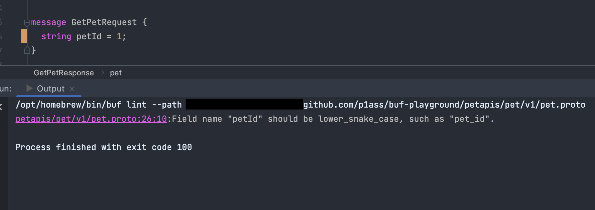

こんにちは、[@p1ass](https://twitter.com/p1ass)です。

この記事では、Protocol Buffers に関連した様々なコマンドを実行できる [Buf CLI](https://github.com/bufbuild/buf) を紹介します。
Buf CLI は、protoc とは異なり、**Formatter や Linter、Breaking Change Detector、依存パッケージ管理など、Protocol Buffers を使う上で便利なコマンドが用意されています。**
Protocol Buffers を使いたいけど CI のセットアップ等が面倒なので、統一して扱いたい人におすすめです。


_Buf のロゴ(公式サイトより引用)_

- 公式ドキュメント: https://docs.buf.build/introduction
- GitHub: https://github.com/bufbuild/buf
- 執筆時のバージョン: 1.6.0

<!--more-->

## Buf CLI の機能

ヘルプコマンドを実行してみると、以下のようなコマンドがあることが分かります。
いくつかピックアップして紹介します。

```bash
$ buf -h
The Buf CLI

A tool for working with Protocol Buffers and managing resources on the Buf Schema Registry (BSR).

Usage:
  buf [flags]
  buf [command]

Available Commands:
  beta        Beta commands. Unstable and likely to change.
  breaking    Verify that the input location has no breaking changes compared to the against location.
  build       Build all Protobuf files from the specified input and output a Buf image.
  completion  Generate auto-completion scripts for commonly used shells.
  export      Export the files from the input location to an output location.
  format      Format all Protobuf files from the specified input and output the result.
  generate    Generate stubs for protoc plugins using a template.
  help        Help about any command
  lint        Verify that the input location passes lint checks.
  ls-files    List all Protobuf files for the input.
  mod         Manage Buf modules.
  push        Push a module to a registry.
  registry    Manage assets on the Buf Schema Registry.

Flags:
      --debug               Turn on debug logging.
  -h, --help                help for buf
      --log-format string   The log format [text,color,json]. (default "color")
      --timeout duration    The duration until timing out. (default 2m0s)
  -v, --verbose             Turn on verbose mode.
      --version             Print the version.

Use "buf [command] --help" for more information about a command.
```

### buf mod

`buf mod` コマンドは、`go mod` コマンドと同様に依存パッケージを管理するコマンドです。

`buf mod init` コマンドを実行することで、 `buf.yaml` が生成されます。

```yaml
# buf.yaml
version: v1
breaking:
  use:
    - FILE
lint:
  use:
    - DEFAULT
```

`buf.yaml` は[モジュール](https://docs.buf.build/bsr/overview#modules)における設定を管理するファイルです。
デフォルトでは、Linter や Breaking Change Detector に関する設定が書かれています。

依存パッケージを追加したい場合は、`deps`に記述することで、[Buf Schema Registry](https://buf.build)からダウンロードしてくれます。

```yaml
# buf.yaml
version: v1
deps:
  - buf.build/googleapis/googleapis
breaking:
  use:
    - FILE
lint:
  use:
    - DEFAULT
```

この例では、[googleapis/googleapis](buf.build/googleapis/googleapis)を依存に追加したので、`google/type/datetime.proto` といった Google Common Types が使えるようになります。

### buf lint

`buf lint` は Protocol Buffers の [Lint](https://docs.buf.build/lint/overview) を実行するコマンドです。

Linter では、[Style Guilde](https://docs.buf.build/best-practices/style-guide)に沿った Lint を実行する他、[カスタマイズした設定](https://docs.buf.build/lint/rules)で実行もできます。

```bash
$ buf lint
# google/type/datetime.proto:17:1:Package name "google.type" should be suffixed with a correctly formed version, such as "google.type.v1".
# pet/v1/pet.proto:44:10:Field name "petID" should be lower_snake_case, such as "pet_id".
# pet/v1/pet.proto:49:9:Service name "PetStore" should be suffixed with "Service".
```

また、Buf では [Editor Integration](https://docs.buf.build/editor-integration) も公式でサポートされているため、ドキュメント通りに設定すれば、エディタでも簡単に Lint の結果を確認できます。


_GoLand での例_

### buf format

`buf format` は名前の通り、Protocol Buffers のファイルを[フォーマット](https://docs.buf.build/format/usage)してくれます。

**フォーマット結果に応じて exit code が変わる** `buf format --exit-code` コマンドも用意されているので、CI への組み込みも簡単です。

### buf generate

`buf generate` は、 `buf.gen.yaml` に書かれた設定に沿ってコードを生成するコマンドです。
`protoc` の代替に当たります。

例えば、`buf.gen.yaml` を以下のようにした場合、Go のコードと gRPC の Go 実装を生成してくれます。
`-I` でしていた部分を yaml で設定するイメージです。

```yaml
version: v1
plugins:
  - name: go
    out: gen/proto/go
    opt: paths=source_relative
  - name: go-grpc
    out: gen/proto/go
    opt:
      - paths=source_relative
      - require_unimplemented_servers=false
```

また、Buf CLI には [Managed Mode](https://docs.buf.build/generate/managed-mode) というものが用意されており、コード生成時のオプションを"よしなに"やってくれます。

例えば、`buf.gen.yaml` に以下のような設定を追記することで、proto ファイルに `option go_package` を書かかなくても、いい感じに Go のパッケージを解決してくれます。

```yaml
managed:
  enabled: true
  go_package_prefix:
    default: github.com/p1ass/buf-playground/petstore/gen/proto/go
    except:
      - buf.build/googleapis/googleapis
```

### buf breaking

`buf breaking` は proto ファイルの破壊的な変更を検出してくれるコマンドです。

**git のブランチなどを指定して差分を見てくれる**ので、CI で破壊的な変更を防ぐといった運用が可能になります。便利。

```bash
buf breaking --against ".git#branch=master,subdir=."
# pet/v1/pet.proto:20:3:Field "1" on message "Pet" changed type from "enum" to "string".
```

## Buf CLI を使いたくなった人へ

これまでにいくつかのコマンドを紹介してきました。
これらのコマンドは Protocol Buffers のエコシステムを活用していく上で、必須・役に立つコマンドだと思います。

Buf CLI を使いたくなった方は、公式の [Tour](https://github.com/p1ass/buf-playground) を一度さらってみることをおすすめします。
20 分程度で完了するので、実際の使い勝手がよく分かると思います。

Buf CLI を使ってスキーマ駆動開発の開発者体験を向上させていきましょう！
