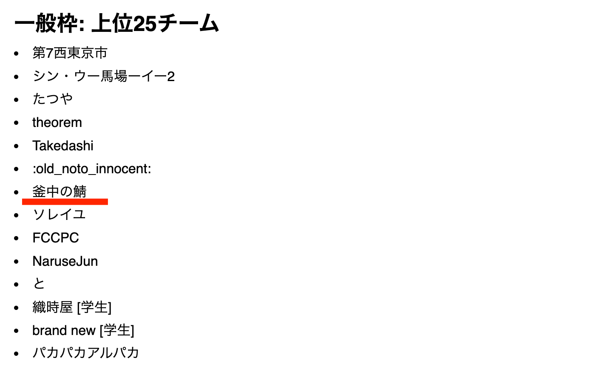
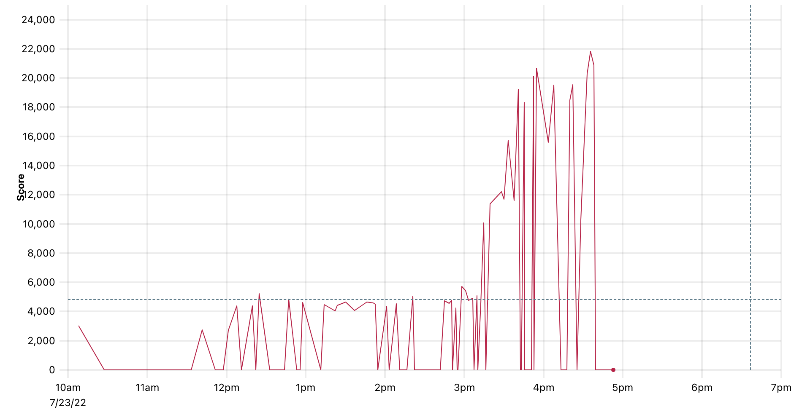

こんにちは、[@p1ass](https://twitter.com/p1ass) です。
先日行われた ISUCON 12 の予選に [@km_conner](https://twitter.com/km_conner) と [@atrn0](https://twitter.com/atrn0) と参加しました。

結果は 35642 点・7 位で、本選に行くことができました。わいわい 🙌





この記事では、事前準備や本番中に入れた改善について紹介します。
なお、今回はコミットごとのベンチのスコアをほとんどメモしておらず、途中のスコアは概算となる点にご注意ください。

<!--more-->

## 事前準備

今年は練習の時間をガッツリ取ることができなかったため、過去問を皆で解くことはしませんでした。
初めてのチーム構成だったため、初動の動きを中心に簡単な役割分担だけは決めておいて、後は「いい感じに」やることになりました。

個人的には、過去問を解いて役に立つスニペットを issue にコピる作業をしました。
これは本番でかなり役に立ったので、学んだことをまとめる習慣は大事だと痛感しました。

## 本番直前

YouTube Live を見ながら、「マルチテナント！これはデータベースのシャーディングをするやつじゃね！？」とか喋ってました。

他にも、「リーダーボードで Redis 使えないかな？」など予想してましたが、実現したものは 1 つもありませんでした。

<iframe width="560" height="315" src="https://www.youtube.com/embed/75YnJ_3289g" title="YouTube video player" frameborder="0" allow="accelerometer; autoplay; clipboard-write; encrypted-media; gyroscope; picture-in-picture" allowfullscreen></iframe>

## 各自初動の対応をする

競技がスタートしたら、予定通り初動の対応をしていきました。

計測ツールのインストールやコードの git 管理を行い、その過程で SQLite が使われていることに気づきました。
pt-query-digest 使えなくて辛いな〜と思いつつも一旦考えないことにしました。

## CGO ビルドに苦戦する

私はアプリケーションのデプロイスクリプト担当だったため、Docker で起動しているアプリケーションをどうデプロイするか悩むことになりました。

我々のチームはローカル PC の Go でビルドしたバイナリを scp する方針で事前準備をしてたので、Docker を剥がしてバイナリを起動するように Service を書き換えました。

ここまでは順調だったのですが、いざデプロイしてベンチを回すと FAIL してしましました。
[mattn/go-sqlite3](https://github.com/mattn/go-sqlite3)が `CGO_ENABLED=1` を要求しているのが原因だったため、フラグをオンにして再チャレンジしたのですが、今後はクロスビルドに対応した C コンパイラが M1 Mac に入っていなかったため、ビルドに失敗するという事態に陥りました。

結果的には、@km_conner が Docker 内でビルドしてバイナリだけ持ってくる方法を提案してくれて、そのまま実装までしてくれました。
ここまでで 1 時間半近く溶かしていたため、本当に申し訳ない気持ちとデプロイスクリプトを更新してくれた@km_conner に感謝しかないです。

これで計測ができるようになったため、メトリクスを見つつボトルネックを潰していく作業に入ります。

## 再起動試験の対策 (@atrn0)

毎回の恒例行事ですが、ビルドに苦戦していた間にさくっと実装しといてくれました。

## JSON Serializer を goccy/go-json に変える (@atrn0)

これもビルド待ちでやっといてくれました。
スコアに寄与しているかは不明です。

## tenant DB 用のインデックスを貼る (@p1ass, @atrn0)

SQLite に対してインデックスを貼っていきました。特にスコアは変わりませんでした。

終了してから気づいたのですが、tenant DB のスキーマは新規のテナントを作るときにしか実行されないので、初期から存在していた tenant に対してはインデックスを貼れていない説が濃厚です。

## MySQL を別インスタンスにする (@km_conner)

元々 MySQL は別インスタンスにする予定だったため、予定通り別インスタンスに移動してもらいました。

この時点で 12 時を回っており、スコアは 4000 程度でした。

## ランキングの N+1 を 1 つ潰す (@p1ass)

ここからスコアの上がらない時間が 3 時間ほど続きます。

alp を見たところ、ランキング取得の API の sum が top1 だったため、改善に取り掛かりました。
ループの中で player を N 回引いている部分があったので JOIN で一発で取ってくるようにしました。

## 失格情報を 3 秒キャッシュする (@atrn0)

マニュアルによると、プレイヤーの失格情報の反映は 3 秒遅れても良いということだったので、TTL3 秒のインメモリキャッシュを入れてくれました。

## tenant DB の MySQL 化を挑戦する (@km_conner)

pt-query-digest で SQLite のスローログが見れないのは厳しいよね、という話になり、MySQL に移行できないか試してもらうことにしました。

30 分後くらいに「データ移行にかなり時間がかかって initialize でタイムアウトしそう」ということが分かり、移行は断念する判断をしました。

会社の times で SQLite は意外と速いという話を聞いていたので、まあなんとかなるだろうという気持ちがありました。

## ランキングの N+1 をもう 1 つ潰す (@p1ass)

`player_score` は同じプレイヤーのスコアが複数回 INSERT されているため、単純な `WHERE LIMIT` で取ってこれない様になっていました。
参考実装では、全部取ってきてからアプリケーション側でフィルターして再ソートするようになってました。

そこで、サブクエリを使って一発でランキングを取ってこれるようにしました。
インデックスも聞いてないような気がするし、スコアも対して上がらない微妙な実装になってしまいました。

```sql
SELECT tmp.player_id, tmp.score, tmp.display_name FROM
      (SELECT ps.player_id, max(ps.score) as score,p.display_name FROM player_score as ps
      INNER JOIN player p on ps.player_id = p.id
      WHERE ps.tenant_id = ? AND ps.competition_id = ?
      GROUP BY ps.player_id
      ORDER BY score DESC) as tmp
      INNER JOIN player_score as tps on tmp.player_id = tps.player_id and tmp.score = tps.score
      ORDER BY tmp.score DESC, tps.row_num ASC
```

## player を取得する API の N+1 を潰す (@atrn0)

competition ごとのスコアの取得が N+1 になっていたので、`IN` を使って取ってくれるようにしてくれました。

## ID 生成を Go でやる (@km_conner)

一意な ID を生成するために毎回 `REPLACE` をするようわからん実装になっていたので良い感じに直してくれました。

```go
auto_increment_id int64 = 0
auto_increment_id_base string = strconv.FormatInt(time.Now().Unix()%100000, 10)

func dispenseID(ctx context.Context) (string, error) {
  newId := atomic.AddInt64(&auto_increment_id, 1)
  return fmt.Sprintf("%d%s", newId, auto_increment_id_base), nil
}
```

これが１つ目のブレイクスルーとなり、4000 点台から 10000 点まで一気に上がりました。

負荷傾向も大きく変わり、今まで iowait が占めていた部分がなくなり、user が多く占めるようになりました。
また、徐々に負荷が高くなっていき最終的に 100%に張り付く挙動を確認できました。

## 排他制御を Go の mutex でやる (@p1ass)

元々の実装では tenant DB への書き込みをファイルロックで制御している見たことない実装になってました。

SQLite のトランザクションを使うことも考えましたが、ほとんどが Read Lock だけで十分であることを考えると、`sync.RWLock` を使ってロックを取るほうが色々良いだろうという結論になり、Go で実装することにしました。

ロックの管理は `map[string]*sync.RWMutex` 相当の構造体で管理しました。

## billing の N+1 改善+早期リターン+キャッシュ (@p1ass)

billing API はこの時点(15 時)でも 6~7 秒かかる激ヤバ API だったのでどうにかしなきゃということで取り掛かりました。

まず、`player_score` の `INSERT` が N 回呼ばれていたので Bulk Insert するように変更しました。

次に、`BillingReport` は大会が終了していない場合は、プレイヤー人数や請求金額を計算する必要がありません。この条件に従って早期リターンするようにしました。

```go
func billingReportByCompetition(ctx context.Context, tenantDB dbOrTx, tenantID int64, competitonID string) (*BillingReport, error) {
  // 早期リターン
  if !comp.FinishedAt.Valid {
    return &BillingReport{
      CompetitionID:    comp.ID,
      CompetitionTitle: comp.Title,
      // 他のフィールドは計算不要
    }, nil
  }
  // ...
}
```

逆に、大会が終了した場合は請求金額が確定し、それ以降は変更されないので永続的にキャッシュできます。

```go
func billingReportByCompetition(ctx context.Context, tenantDB dbOrTx, tenantID int64, competitonID string) (*BillingReport, error) {
  cached, ok := bililngCache.Get(competitonID)
  if ok {
    return cached, nil
  }
  // 中略
  // 計算後の処理でキャッシュする
  if comp.FinishedAt.Valid {
    bililngCache.Set(comp.ID, report)
  }
  // 略
}
```

これらの変更で 16000 点程度まで上がりました。

## MySQL のパラメータチューニング (@km_conner)

よくある `max_connection` やバッファーのチューニングをしてくれました。

## マージしてなかった player を取得する API の改善をマージ (@atrn0)

最初の方に実装したけど放置していた PR があったそうで、最新の master を取り込んで計測してみたら 20000 点までいきました。
最初に実装したときはスコアが上がらななかったからマージしてなかったらしいです。

## ランキングの更なる改善に取り組み始める (@atrn0)

この時点での alp の sum のトップはランキングだったため、ランキングさえ改善できればスコアが跳ねそうということが見えていました。
そこで、その改善をすべて @atrn0 に任せることにしました。

## 大会のスコアの INSERT 処理を Bulk Insert 化 (@km_conner)

N 回クエリを打ってたので Bulk Insert 化してくれました。
スコアは 21000 点程度まで上がりました。

このあたりでスコアボードが凍結し、残り 1 時間になりました。


_凍結時点までのスコアグラフ_

## 再起動試験

このあたりで再起動試験を行いました。
その過程で色々バグが見つかり、てんやわんやしながら直していました。

そうこうしているうちに残り 30 分程度になっていました。

## いらないログやプロセスを止める (@p1ass)

計測に使っていたログや netdata などを止めて CPU の空きを作りました。

## 残り 10 分で@atrn0 のランキング改善が完成する

残り 10 分というタイミングで@atrn0 のランキングの改善が完成しました。
ここでデプロイするかどうか悩んだのですが、明らかなボトルネックを潰せた場合の効果はでかいと思ってベンチを回すことにしました。

ベンチの結果はまさかの**FAIL**。
@atrn0 はもうダメだな〜というムードだったのですが、ベンチのログを見ると、`Connection reset by peer` の文字が。

それを見て僕と@km_conner が「Nginx のコネクション設定！！！」とすぐ気づき、急いで `worker_connections` と `worker_rlimit_nofile` 引き上げてベンチを再実行しました。

結果は、**15000 点上昇の 37000 点。**
このときは思わず大きな声を上げてガッツポーズをしてしまいました。

その後、残り 5 分で簡易的な再起動試験を行い、競技時間が終了しました。

## 残り 10 分で改善を入れ続けたことについて

振り返ってみてもかなり強気な判断をしたな〜と思ってます。
ただ、FAIL 後の流れはかなり確信を持って Nginx の修正ができました。

まず、ベンチが FAIL したのは最初の整合性チェックではなく、エラー上限に達した打ち切りによるものでした。
つまり、@atrn0 の改善実装に間違っている部分はなく、アプリケーションコードの問題ではないことがすぐ分かりました。

また、`Connection reset by peer` は ISUCON を何度かやっていたら一度は見たことあるエラーで、Nginx を直せば良いことは明白でした。(本当は初動で設定するはずが CGO で時間を取られて忘れていた)

さらに、コネクションのエラーは今まで出ていなかったことから、ベンチが今まで以上のリクエストを送っていることが明らかで、これを捌き切ればスコアが爆上げするのも簡単に予想できました。

1~2 時間かけてやりきった@atrn0 の実装力と@km_conner や僕の経験が合わさったまさにチームワークと言える 10 分間でした。

## おわりに

僕がリーダーを務めるチームは 1 回目は FAIL で本選を逃し、2 回目は 48 位で敗退していたため、3 回目の今回はなんとしても本選に行きたいと思ってました。
7 位という予想以上の上位で本選に進出することができて本当に嬉しいです。

一緒に戦ってくれたチームメンバーには感謝しかないです。本選も頑張りましょう！

また、毎年素晴らしいコンテストを開催していただける ISUCON 運営の皆さん本当にありがとうございます！
