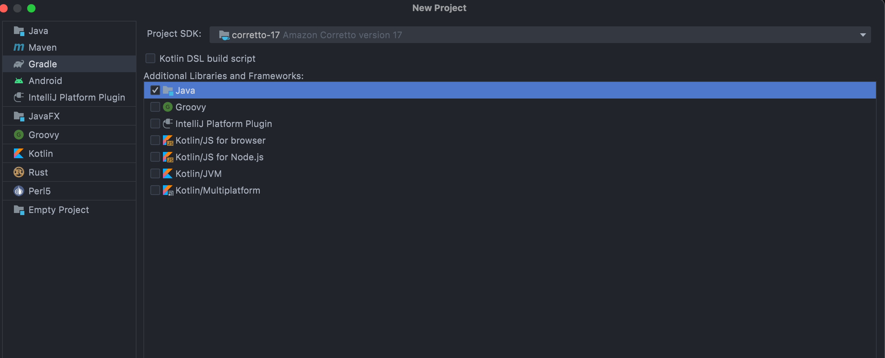

こんにちは、[@p1ass](https://twitter.com/p1ass) です。

この記事は、他のプログラミング言語を書いているが Java はそんなに書いていない/忘れた私が Java をキャッチアップするために得た知識をまとめたものです。
ある程度他の言語を書いている人であれば文法周りは困らないと思うので、エコシステム周りを重点的に書いています。

<!--more-->

## 1. ローカル開発環境構築

現在の環境は次の通り。

| 項目              | 値            |
| :---------------- | :------------ |
| OS                | macOS Big Sur |
| Java バージョン   | 17            |
| Gradle バージョン | 7,2           |

### 事前知識: Java 自体の開発とディストリビューション




### 事前知識: `JAVA_HOME`とは



### 選択肢 1: `/usr/libexec/java_home` を使う

`java_home` コマンドを使うことでインストールされている Java のバージョンの一覧を取得できる。

```bash
$ /usr/libexec/java_home -V
Matching Java Virtual Machines (1):
    11.0.3 (x86_64) "AdoptOpenJDK" - "AdoptOpenJDK 11" /Library/Java/JavaVirtualMachines/adoptopenjdk-11.jdk/Contents/Home
/Library/Java/JavaVirtualMachines/adoptopenjdk-11.jdk/Contents/Home
```

`-v`オプションで利用するバージョンを指定できる。

```bash
$ /usr/libexec/java_home  -v 11
/Library/Java/JavaVirtualMachines/adoptopenjdk-11.jdk/Contents/Home
```

`JAVA_HOME` の設定は次のようにすれば良い。

```bash
$ export JAVA_HOME=`/usr/libexec/java_home -v 11`

$ java --version
openjdk 11.0.3 2019-04-16
OpenJDK Runtime Environment AdoptOpenJDK (build 11.0.3+7)
OpenJDK 64-Bit Server VM AdoptOpenJDK (build 11.0.3+7, mixed mode)
```

`java_home` コマンドの注意点として、同じバージョンの違うディストリビューションは指定できない。
同じバージョンの別ディストリビューションを切り替えたい場合は後述する jenv を使う。

### 選択肢 2: jenv を使う



jenv は Java のバージョンを切り替えて、自動で `JAVA_HOME`を設定してくれるライブラリ。
ディストリビューションは自分でインストールする必要がある点に注意する。
自分の環境は jenv でセットアップしている。

インストールの仕方は README を参照。

### Amazon Corretto のインストール



いろんなディストリビューションがあるが、今回は Corretto を使う。
pkg を落としたら、 `jenv add` して `jenv global` で切り替える。

## 2. エディターセットアップ

IntelliJ IDEA を使う。



Community 版なら無料で使える。使い方は公式の日本語ドキュメントを参照。



設定せずに先程インストールした Corretto が選択できるようになっているはず。

## 3. Gradle プロジェクトを作成

Gradle は Java で使われる OSS のビルドツール。
Maven が使われることもあるが、周りは Gradle を使っている人が多いので、ここでは Gradle を使う。





IntelliJ でプロジェクトを作成するときに Gradle を選べば、良い感じのプロジェクトを作ってくれる。

記事執筆時点では、Java17 のリリース直後だったので、次のようなエラーが出てしまった。

```bash
Unsupported Java.
Your build is currently configured to use Java 17 and Gradle 7.1.

Possible solution:
 - Use Java 16 as Gradle JVM: Open Gradle settings
 - Open Gradle wrapper settings, change `distributionUrl` property to use compatible Gradle version and reload the project
```

`./gradle/wrapper/gradle-wrapper.properties`の `distributionUrl`のバージョンを 7.2 にあげて、 `./gradle wrapper`する。

```bash
# ./gradle/wrapper/gradle-wrapper.properties
distributionBase=GRADLE_USER_HOME
distributionPath=wrapper/dists
distributionUrl=https\://services.gradle.org/distributions/gradle-7.2-bin.zip
zipStoreBase=GRADLE_USER_HOME
zipStorePath=wrapper/dists
```

その後、IntelliJ で Shift 2 回押して、Reload All Gradle Projects をすれば直った。

`src/main/java/helloworld/HelloWorld.java`を作成して、Hello World する。

```java
package helloworld;

public class HelloWorld {
    public static void main(String[] args) {
        System.out.println("Hello World");
    }
}
```

実行はエディターの UI やショートカット、もしくはターミナルから実行できる。

```bash
$ ./gradlew build

BUILD SUCCESSFUL in 541ms
3 actionable tasks: 3 up-to-date

$ java -cp build/classes/java/main helloworld.HelloWorld
Hello World
```

Gradle から直接実行する場合は `build.gradle`を変更する。



```groovy
// build.gradle
plugins {
    id 'application' // 'java' から切り替える
}

application {
    mainClass = 'helloworld.HelloWorld' // エントリーポイントを指定
}
```

```bash
$ ./gradlew run

> Task :run
Hello World

BUILD SUCCESSFUL in 532ms
2 actionable tasks: 1 executed, 1 up-to-date
```

## 4. 基本文法を学ぶ

ある程度他のオブジェクト指向の言語を書いた人ならスルッと入れるので、サクッと流す。



## 5. Java8 以降に追加された文法・ライブラリを学ぶ

Java8 以前と以降でだいぶ異なるところがある。
適当にググると古いやり方が出てきたりするので注意する。

- Stream
  - map や filter といった高階関数系のメソッドやラムダ式など
- Optional
  - Null を扱いやすくするクラス
- `var` を用いた型推論
  - 変数定義時に毎回型を省略できる
- `java.time.LocalDate`など新しい日時クラス
  - 以前は `java.util.Date`や `java.time.Calendar`が使われていたらしい
  - ネットで日時系の処理を調べると古いやり方が引っかかたりするので注意

## 6. サードパーティライブラリを使う

Gradle でサードパーティライブラリを扱う仕組みは公式ドキュメントに書かれている。



### リポジトリの指定

Java のライブラリの多くは Maven Central というリポジトリにホスティングされている。
`build.gradle` で Maven Central から依存を解決するように指定する。(最初から書かれている場合もある)

```groovy
repositories {
    mavenCentral()
}
```

### 依存関係の記述

`build.gradle` の dependencires ブロックに記述する。

今回は JSON ライブラリである Jackson をインストールする。
`implementation` 等の意味は先ほどの Gradle の公式ドキュメントだけでなく、Android の公式ドキュメントなどにも書かれている。



```groovy
dependencies {
    testImplementation 'org.junit.jupiter:junit-jupiter-api:5.8.0'
    testRuntimeOnly 'org.junit.jupiter:junit-jupiter-engine:5.8.0'
    implementation 'com.fasterxml.jackson.core:jackson-databind:2.12.5' // 追加
}
```

```java
package helloworld;

// importする
import com.fasterxml.jackson.core.JsonProcessingException;
import com.fasterxml.jackson.databind.ObjectMapper;

public class HelloWorld {
    public static void main(String[] args) throws JsonProcessingException {
        var user = new User();
        user.id = "p1ass";
        user.name = "ぷらす";

        var mapper = new ObjectMapper();
        System.out.println(mapper.writeValueAsString(user));
    }

    public static class User {
        public String id;
        public String name;
    }
}
```

```bash
$ ./gradlew run

> Task :run
{"id":"p1ass","name":"ぷらす"}
```

## 7. 雑に有名所のサードパーティライブラリを知っておく

必要になったときにググれるように、ある程度インデックスを貼っておく。



## 8. スタイルガイドを知る

より良い書き方を学ぶ。



<iframe style="width:120px;height:240px;" marginwidth="0" marginheight="0" scrolling="no" frameborder="0" src="//rcm-fe.amazon-adsystem.com/e/cm?lt1=_blank&bc1=000000&IS2=1&bg1=FFFFFF&fc1=000000&lc1=0000FF&t=p1ass02-22&language=ja_JP&o=9&p=8&l=as4&m=amazon&f=ifr&ref=as_ss_li_til&asins=4621303252&linkId=d8a2840be719aa666e8b5acbee030bc6"></iframe>

## 9. Linter・Formatter

お好みで設定する。

### Linter

- [https://github.com/google/error-prone](https://github.com/google/error-prone)
- [https://spotbugs.readthedocs.io/ja/latest/index.html](https://spotbugs.readthedocs.io/ja/latest/index.html)
- [https://checkstyle.sourceforge.io/](https://checkstyle.sourceforge.io/)

### Formatter

- [https://github.com/diffplug/spotless](https://github.com/diffplug/spotless)
- [https://github.com/google/google-java-format](https://github.com/google/google-java-format)
  - Spotless と合わせて使うか、プラグインを使う
  - [https://github.com/sherter/google-java-format-gradle-plugin](https://github.com/sherter/google-java-format-gradle-plugin)

## 10. Gradle のマルチプロジェクトを使って大規模なプロジェクトを作る

1 つのプロジェクトの中に複数のプロジェクトを作成できる機能。
API・バッチ・共通ライブラリをそれぞれ別のプロジェクトにしつつ、1 つのリポジトリで管理できる。

自分で 1 からプロジェクトを作ることは少ないかも知れないが、既存のプロジェクトがマルチプロジェクトになっていることは結構あるので、「`build.gradle` が複数あるんだけど！」ってならないために知っておくと良さそう。



## おわりに

最初の数日でキャッチアップするなら、このくらいなのではないでしょうか。
