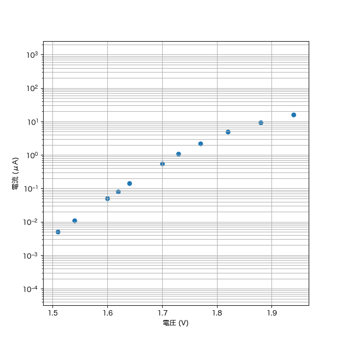
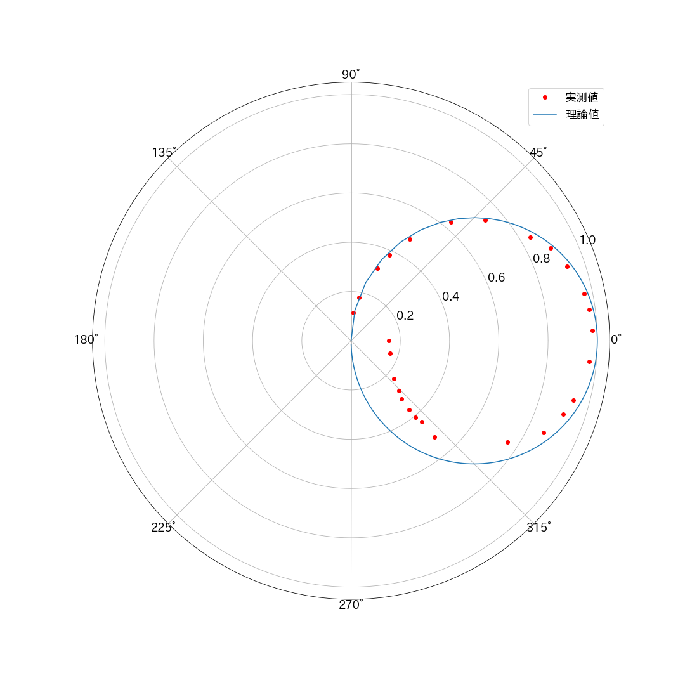
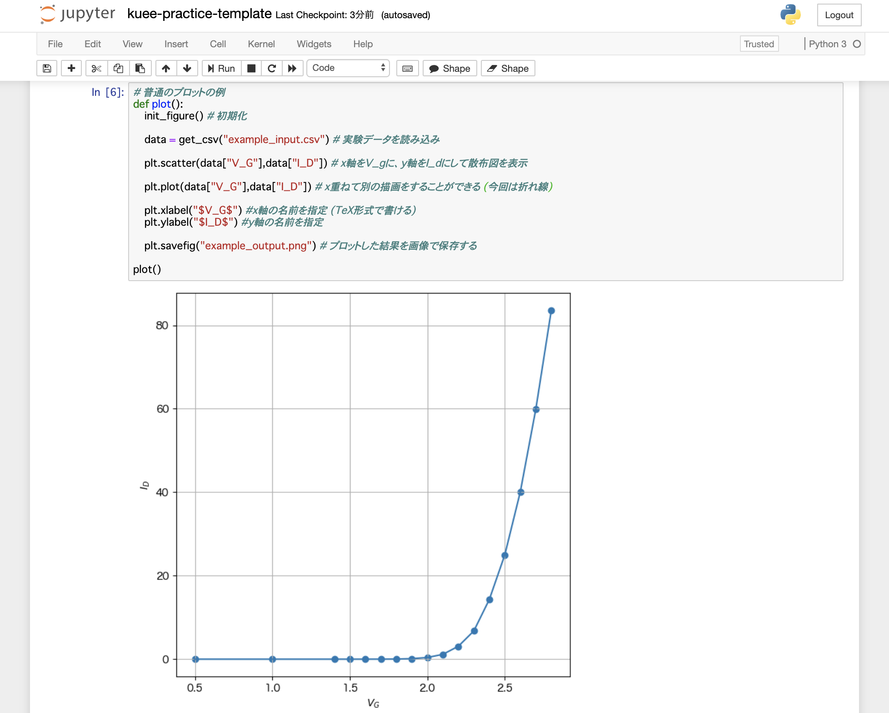

この記事はの 13 日目の記事です。

## はじめに

こんにちは、です。

いつもと違う人が見てくれていると思うので軽く自己紹介しておくと、京都大学工学部電気電子工学科 (通称電電) の 3 回生で、プログラミングを少し嗜んでます。今回のの発起人の１人です。



発起人の１人として、まともな記事を書かなきゃという気持ちもあるのであるが、今回はあえて電電生に向けた記事を書こうと思います。

この記事では、電電の実験を **時間効率を上げて素早く終わらせることを目標** し、データの処理やプロットなどを短時間で行う Tips や班員の役割分担の効率化方法をいくつか紹介していきます。実験一般的な話も多いため、電電生以外にとっても役に立つ内容もあるので是非見ていってください。

なお、あくまで学部の必修の実験を対象にしているので、研究ではあまり役にたたないと思います。

<!--more-->

## ブラック電電と実験

さて、京大の電気電子工学科といえば **「ブラック電電」** 言われるように、かなりきつい学科として巷では有名です。

3 年近く電電の中に身を置いてると、「そんなにブラックか？🤔」と思うのですが、 **扱う学問の幅広さ、それに伴う課題の多さ、数歩間違えると 20 時近くまでかかる実験** 、、などなど他の学科と比べると客観的に見ても大変な学科と言えそうです。

特に **「扱う学問の幅広さ」** 実験の難易度に直結します。

電電では主に、「電気」「電子」「情報」の 3 つの分野について学びます。これらの座学のほとんどは選択科目なので、自由に選ぶことができます(建前上)。しかし、必修の実験ではこれら 3 つのすべての分野の内容に関する実験を行うため、自分の興味ない、すなわち履修していない講義の実験を行う必要が出てきます。

全く理解していないのに、実験を行って考察をしなければならないのはかなりの苦痛です。

文句を言っても、実験は必修なので、何が何でも受けなければなりません。実験が好きな人にとっては良いかもしれませんが、そもそも電電を第一志望で入ったわけではない自分の場合はなんとかして **楽にかつ短時間で** 験を終わらせることはとても重要なのです。

## 効率化できる作業と出来ない作業

電電の実験は、大まかに以下の 4 つのパートに分かれています。

1. 教科書を読んで実験内容を理解する
2. 実験を行ってデータを取る
3. データをプロットしたり解析する
4. 考察する

この中で最も効率化できるのは 3 の **「データをプロットしたり解析する」** す。

プロットや解析は最終的に出力するものは 1 つですが、そのための手段は多数用意されています。プロットであれば、紙か PC かだけでも違うでしょう。手段が多く用意されていればいるほど、効率化の可能性が高まります。

1 の「教科書を読んで実験内容を理解する」は実験の前に予習してきたら、確かに実験を早く終わらせることができそうです。しかし、教科書を読むという作業は実験室でやろうが、家でやろうがかかる時間は変わりません。これは時間対効果の観点から効率化できたとは言わないでしょう。

2 と 4 は 3 ほどではないですが、多少効率化できそうです。

## Tips 紹介

さて、ここからが本題です。効率化できる作業をどんどん効率化していきましょう。

ここでは、効率化の難易度を EASY、NORMAL、HARD の三段階に分けて紹介します。

まずは EASY の誰でもできるものから挑戦していき、他のものにも挑戦していくと良いでしょう。

### EASY : プロットは 1 人が作って班員で共有する

紙であれ PC であれ、電電の実験では多数のプロットを行います。

これらのプロットはわざわざ班員全員が別々に作業を行う必要は **全く** りません。
１人が紙にプロットしてコピーする、データを LINE で送るなどをすれば、他の班員は他の作業を行うことが出来ます。
次の実験の配線を準備したりしておけば、プロットが終わったタイミングですぐ次の実験に移れます。

これだけでもかなりの時間を効率化出来るでしょう。

また、 **プロット担当の人は半期を通して同じ人が担当すると良いです** この作業は慣れれば慣れるほど素早くできるようになるので、4 月と 7 月では作業スピードが段違いです。よっぽど担当になった人がヘタクソでない限り変えないほうが良いです。自分がこの作業に向いていると思うのなら、1 週目から名乗りを上げるとスムーズだと思います。

### EASY : 行き詰まった時は人に聞く

実験では、教科書を読んでもイマイチ実験方法が分からないことや考察の方法が分からないことが多々あります。

班の中である程度相談して、それでも分からなかった場合は素直に別の班の人や TA、先生に聞きましょう。

これは実験であって研究ではありません。同じことをやっている人がいるのであれば、 **お互いに話し合った方が効率が良いですし、内容も深く理解出来ます**

**班の誰も理解できなくて無言の状態で時間だけ過ぎていくのは最も虚無で無駄です。** かしながら、このような状況に陥っている班は意外と多いです。

人に聞くという行為は全く恥ずかしい行為ではないので、積極的に相談していきましょう。

### NORMAL : データを紙で管理するのをやめる

悪しき物理学実験では、実験データは実験ノートに、プロットは紙のプロット用紙に行わなければなりません。しかし、電電の実験では紙で行う必要はありません。

そんなどうでも良いことで時間を使うのは本質的ではないので、データは素直にデジタルで管理しましょう。

データの受け渡しは簡単ですし、テーブルの途中に値を差し込むのも簡単です。

単純な XY グラフであれば Excel でも十分なので、まず一歩デジタル移行しましょう。

### NORMAL : csv でデータを保存する

csv は Comma-Separated Values の略で、コンマ区切りされたテキストデータの事です。拡張子は `.csv` で次のようなフォーマットのファイルです。

```plaintext
Registance,Voltage
1,2
2,4
3,6
```

このフォーマットの良いところは

- プログラムから扱いやすい
- テキストファイルなので、メモ帳を初め様々なエディタで開ける
- Excel でも開ける

の 3 つです。

次にプロットを Python で行う話があるのですが、データを csv で保存しておくことで簡単にプログラムから読み込むことが出来ます。`.xlsx`ファイルはプログラム側から扱いにくいのであまり使いたくありません。

csv はメモ帳でも開くことができるので誰でも見ることが出来ますし、Excel でも開くことが出来ます。Excel でも開くことが出来るので、データを取る人が csv で取っておけば、プログラミング出来る人も出来ない人も幸せになることが出来ます。

是非積極的に使っていきましょう。

### HARD : プロットや解析を Python で行う

個人的にここが一番話したい内容なのですが、プログラミングの知識が必要なので HARD に分類しました。
ですが、最も時間を短縮できるハックなので、是非覚えておきたい内容です。

Python はプログラミング言語の 1 つで、他の言語に比べ簡単に使えるところが特徴です(要出典)。
機械学習を始めとする数値計算に使われる場合が多く、Jupyter Notebook というツールと合わせて簡単にデータの可視化が出来ます。


_Python でプロットしたグラフの例_


_極座標のプロットも出来る_

Python でプロットや理論値を求めるのが良いと思っているのは、手続き的ではなく宣言的に行うことが出来る点です。

以下のコードは先の極座標プロットを行うためのコードの一部ですが、計算は一行コードを書くだけで済んでいます。

```python
# 実測値をプロット
df = pd.read_csv("input_data.csv")
plt.polar(np.deg2rad(df["位相差"]),df["CH2/CH1"],  'ro', label="実測値")

freq_array = np.linspace(0, 100000000, 500000)
omega_array = 2 * np.pi * freq_array
#ここが理論値を求める計算
v = (1j * omega_array * L) / (R - omega_array**2 * L * C + 1j * omega_array * L)

theta = np.angle(v)
absolute = np.abs(v)
plt.polar(theta, absolute, label="理論値")

plt.legend()

plt.savefig("polar_plot.png")
```

もし、これが Excel であれば、何十行、何百行とある行全てに計算式を適用する必要がありますし、それを何列かに分けて行う必要があります。また、パット見でどんな計算をしているのか分かりづらく、計算があっているかどうか確かめるのが難しいです。これらの問題はコードを書くことで解決出来ます。

他にも実験のデータを取り始める前にコードを書いてしまえば、 **一行データを追加するたびにプロット結果をすぐに確認することが出来ます。**このおかげで、実験結果がおかしいことにすぐ気づくことが出来ます。全てのデータを取ってから解析するようなフローにしていると、**全てやり直しの悪夢** 見る可能性がありますが、そのようなことは発生しません。結果として、2 の「実験を行ってデータを取る」を短時間で行うことができるようになります。

実験で使える程度であれば、Python の学習コストはそんなに高くないので、ちょちょっと勉強して使い始めると、かなり時間を短縮できると思います。学習時間を加味してもペイできるのではないでしょうか？

## 実験で使える Jupyter Notebook ファイルを公開します

上でさんざん Python を進めましたが、0 から実験で使えるようなコードを書いていくのは大変です。

そこで、実験で使えそうなプロットやデータの読み込みを関数化して使いやすくした Jupyter Notebook ファイルを公開します。



以下の GitHub のリンク先からダウンロードできるので、是非見てください！（GitHub アカウントをお持ちの方は Star もお待ちしています）



## 終わりに

今回の記事では電電実験をいかにして効率的にこなしていくかを紹介しました。

自分にできそうなものから実践していって、効率的に実験をこなしていきましょう 💪

明日のは電電さんです。奇遇にも **電電** すね。お楽しみに！
