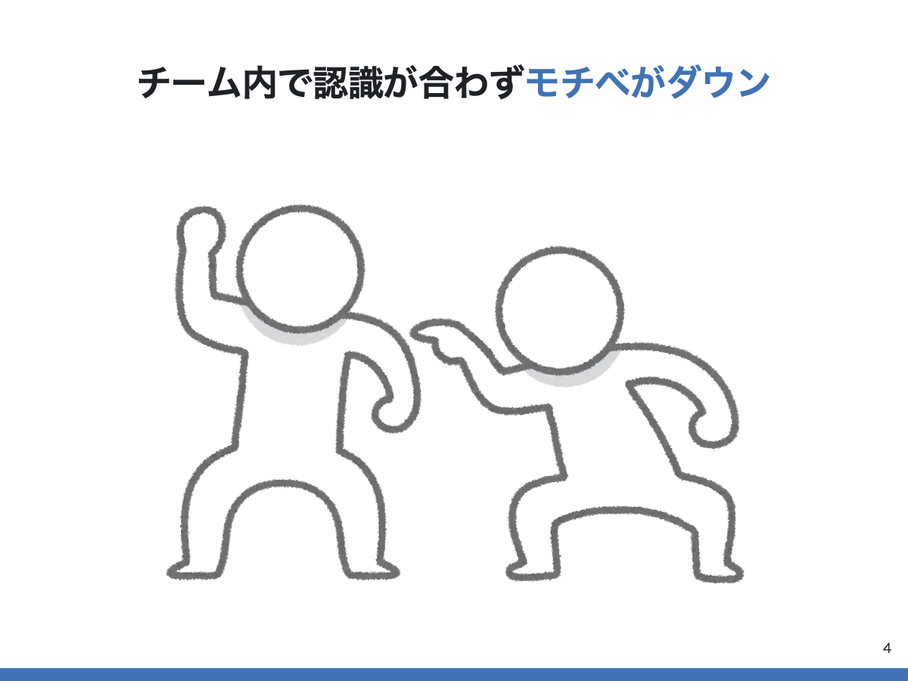
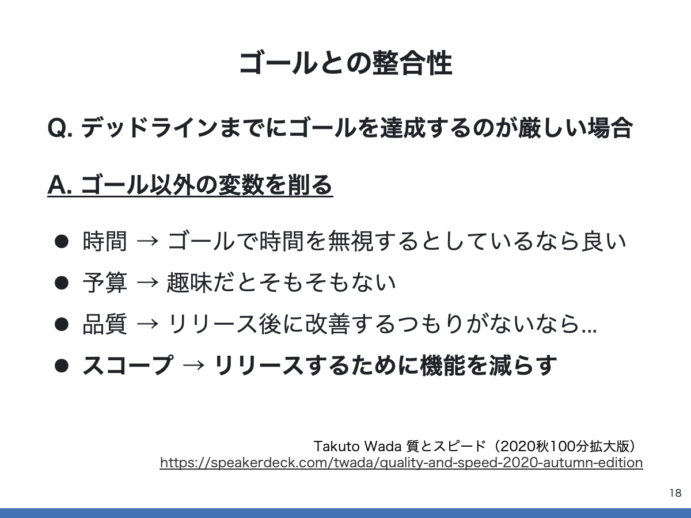
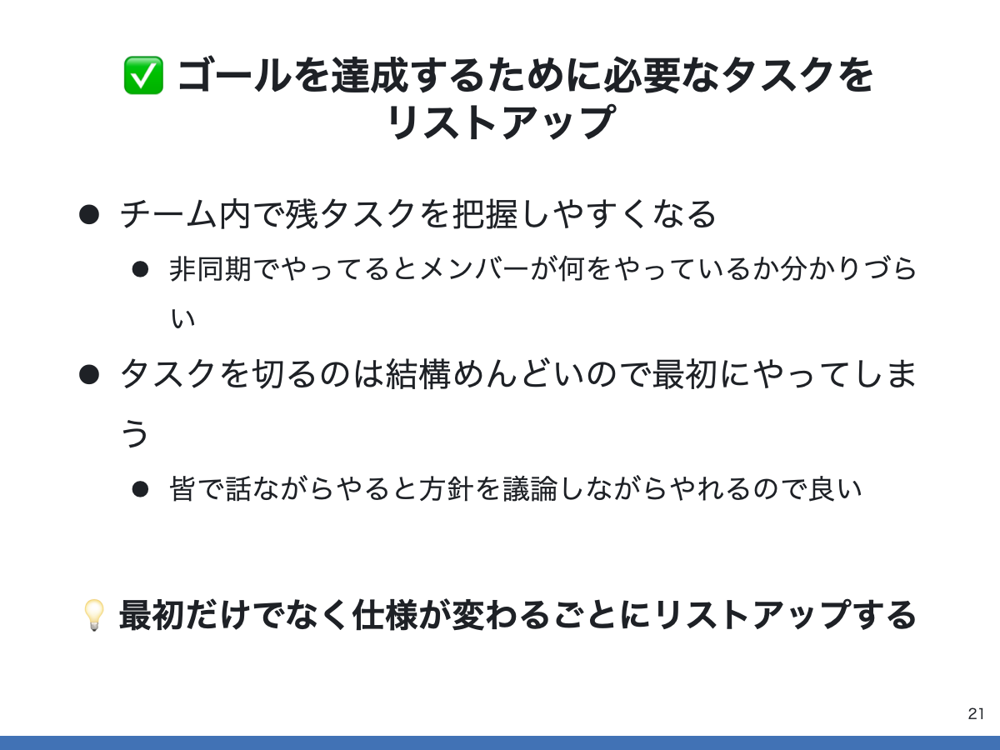
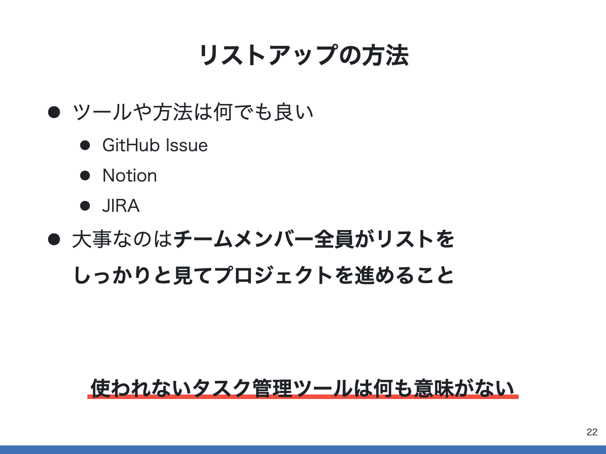
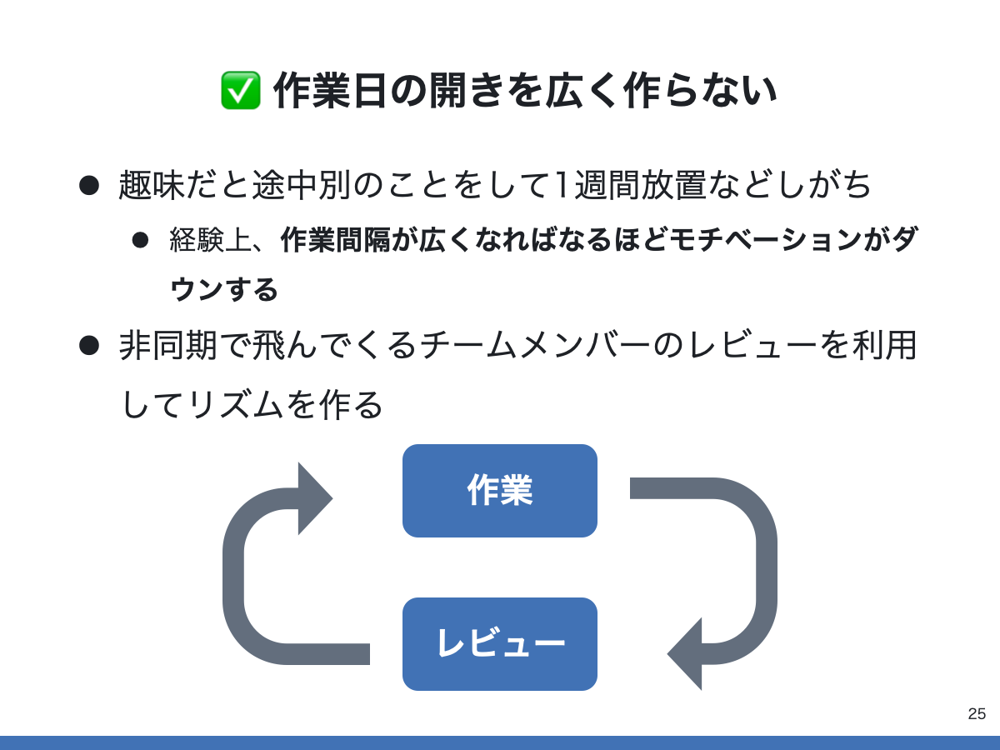
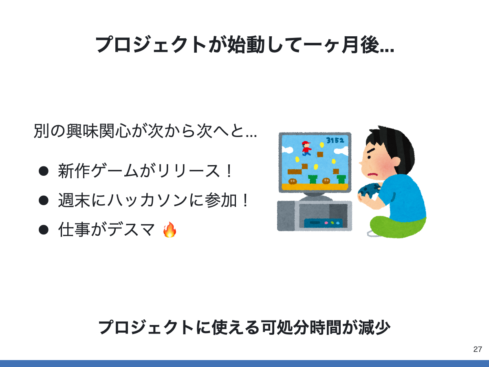
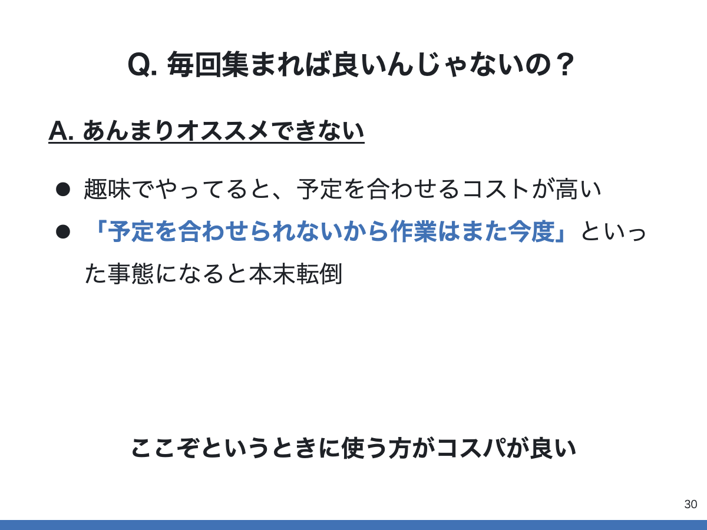
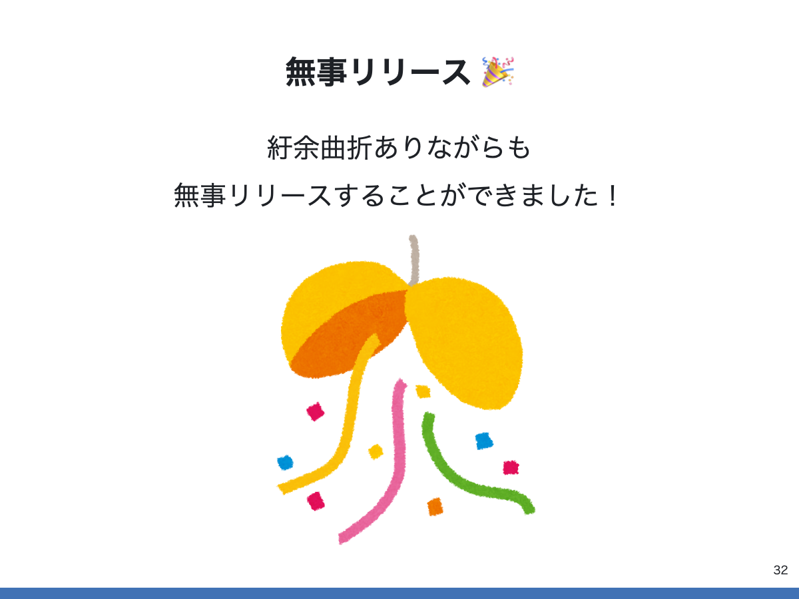

こんにちは、[@p1ass](https://twitter.com/p1ass)です。

この記事は、[CAMPHOR- DAY 2021](https://camphor.connpass.com/event/206786/)で発表した「趣味プロジェクトを支える技術」の書き起こし記事です。
2 ヶ月以上前の発表ですが、重い腰を上げて書きました。

スライドは最後に置いてあるので、長ったらしい文章を読みたくない方はスクロールして読んでください。

ここで書いている内容は個人の経験を元に書いているので万人受けするものかどうかわかりませんが、一例として参考になれば幸いです。

<!--more-->

## はじめに

皆さんは趣味のプロジェクトを進める上で、

- 意気揚々と始めったプロジェクトが最初は順調に進んでいたのにも関わらず、時間が経つにつれて**いつの間にか別のことがやりたくなって自然消滅**

- チームで開発してくぞ！とやる気になっていたのに、**途中でチーム内の認識が合わなくなりモチベーションがダウン**

といった経験は無いでしょうか？

こういった経験の原因はよくよく考えてみると、モチベーションや気持ちの面が大きいと感じます。

そこで今回は、「**感情の波をテクニックを使って乗りこなし、プロジェクトをゴールへ導く**」ことをテーマに色々テクニックについて話したいと思います思います。

### 話のスコープ

また、話がややこしくならないように、今回話す内容のスコープは次のように定めています。

- **趣味**プロジェクトを対象
  - 仕事は感情がボトルネックになることは少ない (要出典)
  - Web サービスのリリースのようなソフトウェア開発に焦点
- 少人数のチームを想定
- プロジェクトの作業は非同期に行う想定
  - 毎回みんなで集まるわけではない

## プロジェクトの最初にゴールと締め切りを決める

さて、 ここからが本題です。

最高のアイデアを思いついた私は友達に声をかけて、Web サービスの開発を始めることにしました。
すぐにでもアイデアの形にしたいので、すぐ実装に取り掛かりたいのですが、その前にいくつか先に決めておきたいことがあります。
それは「**ゴールの決定**」と「**締め切りの決定**」です。

### ゴールを決める

ゴールを決める主な理由は、ゴールを決めずに走り出してしまうと、**「無限にやりたいことが出てきて、いつになってもプロジェクトが終わらなくなってしまうから」** です。

趣味のプロジェクトは仕事とは異なりお金や時間といった外的要因が少ないので、やろうと思えばいつまでも完成度を高めるためにブラッシュアップできてしまいます。
これは良いことでもあるのですが、「完成するのか？」といった不安や飽きといった問題と戦わないといけなくなります。

ゴールを決めることで、このプロジェクトでは何をやって、何をやらないのか、その**判断基準**を作ることができます。
また、付随して、チームで共通認識を作ることが出来るので、**メンバー間の認識の齟齬が発生しづらくなる**といったメリットもあります。

ゴールの具体例として、「次に列挙した機能を持つ Web サービスを**リリースさせる**」というゴールを考えてみます。
このゴールを決めた場合、最優先すべきなのはリリースさせることであって、技術を学ぶことや他の機能を実装することはリリースよりも優先度が低いと考えることができます。
これが先程書いた判断基準になり、無駄な寄り道をしてしまうリスクを低減できます。

勿論これは例えであり、「技術さえ学べればリリースできなかろうと問題ない」と考えてゴールを設定するのもアリです。

ここで決めたゴールはできるだけ文章化して残すのをおすすめします。
口頭だけの合意は往々にして忘れてしまいます。議論になったときにベースとなる資料があると同じ議論を繰り返さず済みます。

ドキュメントの書き方は何でも良いです。リーンキャンパスだろうが、PRD だろうが、ただのテキストファイルだろうが構いません。重要なのは形として残すことです。

### 締め切りを決める

次に決めることは締め切りを決めることです。
締め切りを決める理由はケツを叩く意図もありますが、生活リズムの変化の影響を受けなくするためでもあります。

経験がある方もいるかとは思いますが、私は長期休暇といった生活リズムが変わるタイミングでずっと継続していたものがいつもの時間にできなくなり、継続がストップしてしまうことがありました。
継続が一度ストップしてしまうと再度作業に取り組むのが億劫になり、やる気が出なくなってしまいプロジェクトが頓挫してしまうことがありました。

様々なところで継続は重要と言われていますが、継続は難しいものです。そこで、「**継続を妨げる要因となるであろう生活リズムの変化の影響を受ける前に締め切りを設定し、悪い影響を被らないようにしよう**」というのがここでの考えです。

特に夏休みはガラッと生活が変わるので注意した方が良いです。夏休み前に始めたものは夏休み前に終わらせる。夏休みに始めたものは夏休み中に終わらせるを徹底することをおすすめします。

しかし、締切を決める行為自体が先に決めたゴールと矛盾してしまう場合があります。締め切りまでにゴールを達成するのが難しい場合やそもそもゴールで締め切りは気にしないと決めている場合も考えられます。

その場合は、時間や予算、品質、スコープからゴールに関係のないものを削っていくことになります。
先程の「Web サービスをリリースさせる」ことがゴールの場合は、機能のスコープを削ることになるでしょう。
ここはそれぞれのゴールによって異なります。

この問題はトレードオフなので、しっかりとチームメンバー全員で議論して納得してから決めることが重要です。
人によってこの辺の考えは異なるので、なるべくみんなが納得する形に落とし込めると気持ちよく開発出来ると思います。

## ゴールを決めた次にすること

## やることが固まったら

## 雲行きが怪しくなってきたら

## まとめ

## スライド

