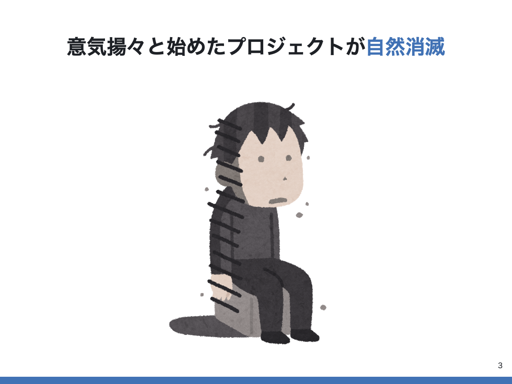
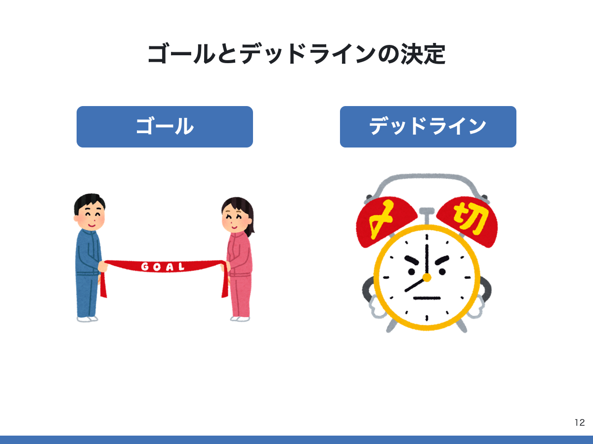
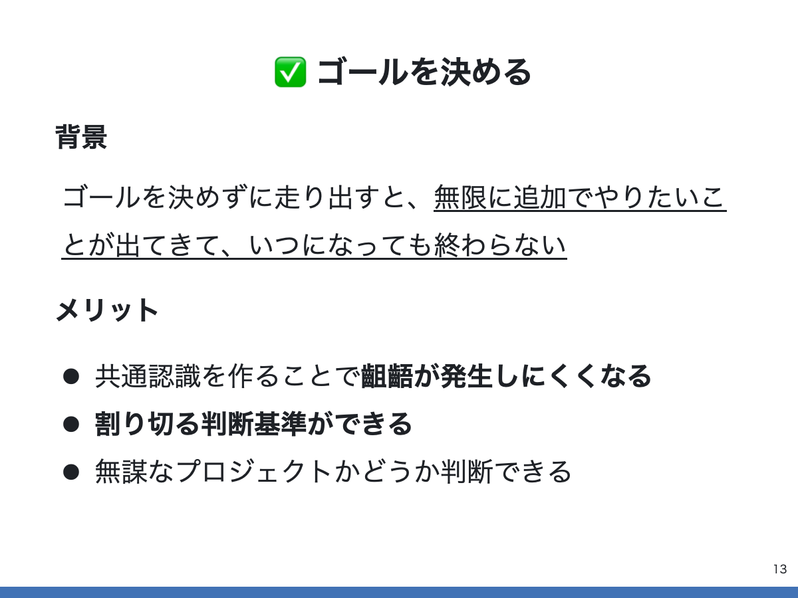
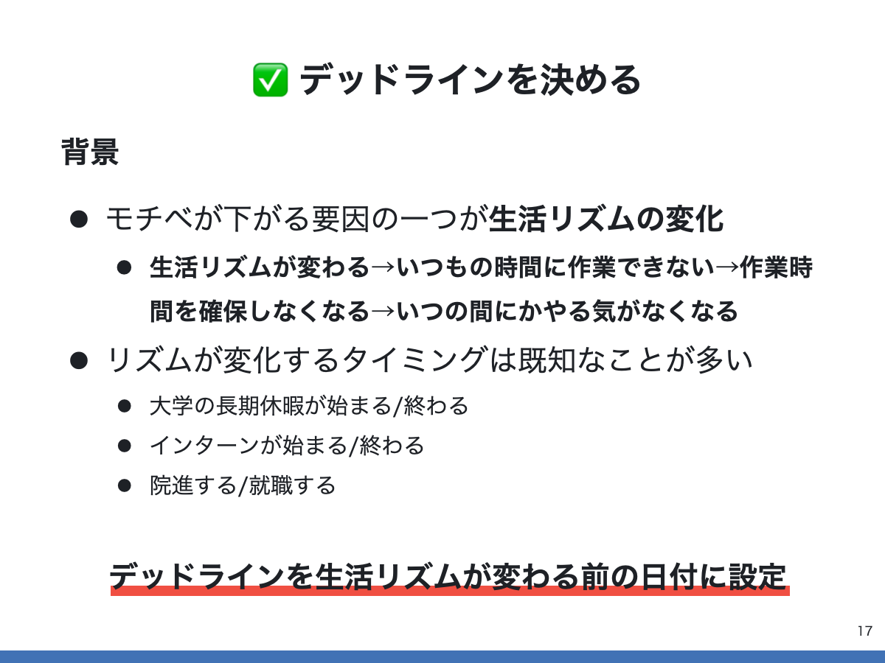
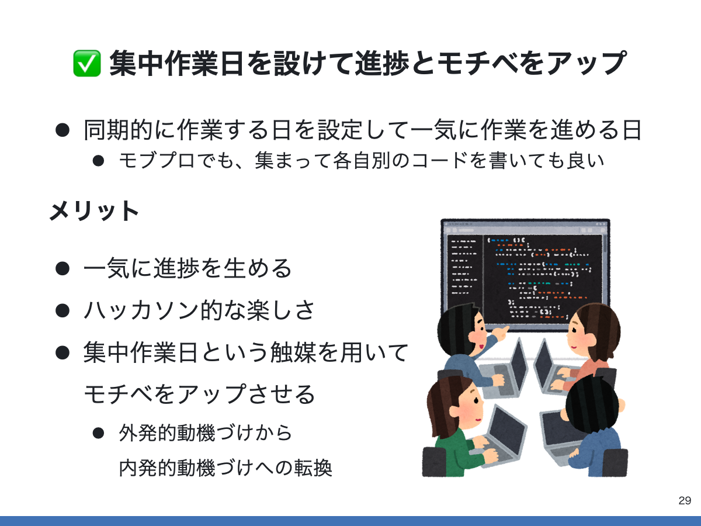
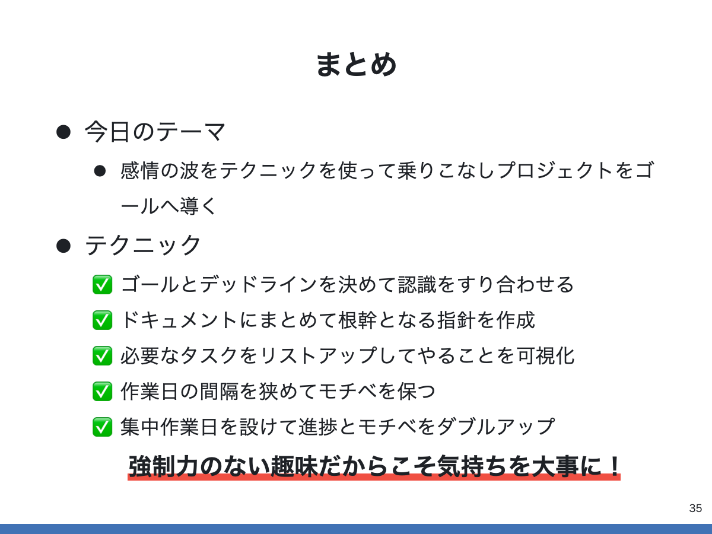

こんにちは、[@p1ass](https://twitter.com/p1ass)です。

この記事は、[CAMPHOR- DAY 2021](https://camphor.connpass.com/event/206786/)で発表した「趣味プロジェクトを支える技術」の書き起こし記事です。
2 ヶ月以上前の発表ですが、重い腰を上げて書きました。

スライドは最後に置いてあるので、長ったらしい文章を読みたくない方はスクロールして読んでください。

ここで書いている内容は個人の経験を元に書いているので、万人受けするものかどうかわかりませんが、一例として参考になれば幸いです。

<!--more-->

## はじめに

皆さんは趣味のプロジェクトを進める上で、

- 意気揚々と始めったプロジェクトが最初は順調に進んでいたのにも関わらず、時間が経つにつれて**自然消滅**

- チームで開発してくぞ！とやる気になっていたのに、**途中でチーム内の認識が合わなくなりモチベーションがダウン**

といった経験は無いでしょうか？

こういった経験の原因は何かと自問してみると、モチベーションや気持ちの面が大きいと感じます。

そこで今回は、「**感情の波をテクニックを使って乗りこなし、プロジェクトをゴールへ導く**」ことをテーマに、モチベーションを下げずにプロジェクトを進めていくテクニックについて話したいと思います。

### 話のスコープ

また、話がややこしくならないように、今回話す内容のスコープは次のように定めています。

- **趣味**プロジェクトを対象
  - 仕事は感情がボトルネックになることは少ない (要出典)
  - Web サービスのリリースのようなソフトウェア開発に焦点
- 少人数のチームを想定
- プロジェクトの作業は非同期に行う想定
  - 毎回みんなで集まるわけではない

## プロジェクトの最初にゴールと締め切りを決める

さて、 ここからが本題です。

最高のアイデアを思いついた私は友達に声をかけて、Web サービスの開発を始めることにしました。
すぐにでもアイデアを形にしたいので、さっそく実装に取り掛かりたいのですが、その前にいくつか先に決めておきたいことがあります。
それは「**ゴール**」と「**締め切り**」です。

### ゴールを決める

ゴールを決める主な理由は、ゴールを決めずに走り出してしまうと、**「無限にやりたいことが出てきて、いつになってもプロジェクトが終わらなくなってしまうから」** です。

趣味のプロジェクトは仕事とは異なりお金や時間といった外的要因が少ないので、やろうと思えばいつまでも完成度を高めるためにブラッシュアップできてしまいます。
これは良いことでもあるのですが、「完成するのか？」といった不安や飽きといった問題と戦わないといけなくなります。

ゴールを決めることで、このプロジェクトでは何をやって、何をやらないのか、その**判断基準**を作ることができます。
また、付随して、チームで共通認識を作ることが出来るので、**メンバー間の認識の齟齬が発生しづらくなる**といったメリットもあります。

ゴールの具体例として、「次に列挙した機能を持つ Web サービスを**リリースさせる**」というゴールを考えてみます。
このゴールを決めた場合、最優先すべきなのはリリースさせることであって、技術を学ぶことや他の機能を実装することはリリースよりも優先度が低いと考えることができます。
これが先程書いた判断基準であり、無駄な寄り道をしてしまうリスクを低減できます。

勿論これは例えであり、「技術さえ学べればリリースできなかろうと問題ない」と考えてゴールを設定するのもアリです。

また、ここで決めたゴールはできるだけ文章化して残すのをおすすめします。
口頭だけの合意は往々にして忘れてしまいます。議論になったときにベースとなる指針があると同じ議論を繰り返さず済みます。

ドキュメントの書き方は何でも構いません。リーンキャンパスだろうが、PRD だろうが、ただのテキストファイルだろうが構いません。重要なのは形として残すことです。

### 締め切りを決める

次に決めることは締め切りです。
締め切りを決めるのはケツを叩く意図もありますが、生活リズムの変化の影響を受けなくするためでもあります。

経験がある方もいるかとは思いますが、私は長期休暇といった生活リズムが変わるタイミングで、ずっと継続していたことがいつもの時間にできなくなり、継続がストップしてしまうことがありました。
継続が一度ストップしてしまうと再度作業に取り組むのが億劫になり、やる気が出なくなってしまってプロジェクトが頓挫してしまうことがありました。

様々なところで「継続は大事」と言われていますが、継続は難しいものです。そこで、「**継続を妨げる要因となるであろう生活リズムの変化の前に締め切りを設定し、悪い影響を被らないようにしよう**」というのがここでの考えです。

特に夏休みはガラッと生活が変わるので注意すべきです。夏休み前に始めたものは夏休み前に終わらせる、夏休みに始めたものは夏休み中に終わらせる、を徹底することをおすすめします。

しかし、締切を決める行為自体が先に決めたゴールと矛盾してしまう場合があります。締め切りまでにゴールを達成するのが難しい場合やそもそもゴールで「締め切りは気にしない」と決めている場合も考えられます。

その場合は、時間や予算、品質、スコープからゴールに関係のないものを削っていくことになります。
先程の「Web サービスをリリースさせる」ことがゴールの場合は、機能のスコープを削ることになるでしょう。
ここはそれぞれのゴールによって異なります。

この問題はトレードオフなので、しっかりとチームメンバー全員で議論して納得してから決めることが重要です。
人によってこの辺の考えは異なるので、なるべくみんなが納得する形に落とし込めると気持ちよく開発出来ると思います。

## ゴール達成に必要なタスクをリストアップ

ゴールを決めたら、次はゴール達成に必要なタスクをリストアップします。

タスクをリストアップすることで、チーム内で残タスクを把握しやすくなるメリットがあります。
タスクを切る作業は結構面倒なので、予め分かる分はモチベーションが高い最初のうちにやってしまうことをおすすめします。
勿論、最初から全部の要件を固めてタスクをリストアップすることは難しいし、開発を進めていく上で必要となるものは変わっていくので、仕様が変わるごとにリストアップしていくと良いです。

リストアップに使うツールは GitHub の Issue だろうが、Notion だろうが JIRA だろうが何でも良いです。
大事なのは**チームメンバー全員がリストをしっかりとメンテしてプロジェクトを進めること**です。
使われないタスク管理ツールには何の意味もありません。

## やることが固まったら作業を習慣づける

やることが決まったら後はタスクを消化していくだけです。
その中で１つおすすめしたいことは**作業日の間隔を開けすぎないこと**です。

趣味だと、ちょっと別のことが忙しかったりすると、作業をしばらく放置してしまうことが多いです。経験上、作業の間隔が広がれば広がるほどモチベーションが下がっていくので、できるだけ作業の間隔を開けない方が良いです。
ソフトウェア開発であれば、コーディングとレビュー対応をうまいこと組み合わせて良いサイクルを回せると定期的に作業ができて習慣づけられると思います。

## 雲行きが怪しくなってきたら集中作業日を設けて進捗とモチベをアップ

作業を習慣づけしようと頑張っても、中々うまく行かないことは多いです。
新作ゲームがリリースされたり、仕事や学校がデスマになったりして、**「いつの間にか作業に使える可処分時間が減ってしまう」** といったことが容易に考えられます。

**可処分時間が減ってしまうのが自分ならまだしも、他のメンバーの作業が怠ってしまうと厄介**です。
レビュー待ちの PR が溜まったり Slack の返信が返ってこなくなってしまうと、自分のモチベーションも下がっってしまいます。

そういう場合は、**全員が同期的に作業する集中作業日を設定**して一気に作業を進めています。
普段は非同期で作業している人をあえて全員（物理・リモート問わず）集めて、みんなでワイワイしながら作業を進めます。
この方法の利点は、みんなが集まるので一気に進捗が生めることだけでなく、合宿やハッカソン的な楽しさを味わえるので、結果としてメンバーのモチベーションが上がることです。（個人差あり）

とはいえ毎回集まるのは大変なのであんまりおすすめはしないです。
毎回集まるルールにすると、予定をあわせるコストが高くて逆に作業の進捗が生めないという事態になることが考えられます。
ここぞというときに上手に使う方がコスパが高いと感じています。

こうして無事完成することができました！

## まとめ

今回は「感情の波をテクニックを使って乗りこなしプロジェクトをゴールへ導く」をテーマに、趣味プロジェクトを前に進めるためのテクニックをいくつか紹介しました。

まずは、認識のすり合わせやモチベーション減少のリスク低減のためにゴールとデッドラインを決めて、その指針をドキュメント化します。次に、タスクを切ってやるべきことを可視化して明確化します。そのタスクを定期的に次々倒していき、行き詰まったら集中作業日を設けてモチベーションを上げていきます。

この方法を使ったとしても、必ずしもプロジェクトのゴールを達成できるとは限りませんが、モチベーションを要因とした課題はある程度解決出来るのではないかと思います。

最後に、今回の対象のプロジェクトは**趣味**です。仕事ではないので強制力はありません。だからこそ自分の気持ちに素直になった方が良いです。つまらないと思ったら、無理にプロジェクトを進める必要はありません。今回の発表は、**楽しみを忘れずにプロジェクトを進めていくためのテクニック**だと思ってもらえれば幸いです。

## スライド

