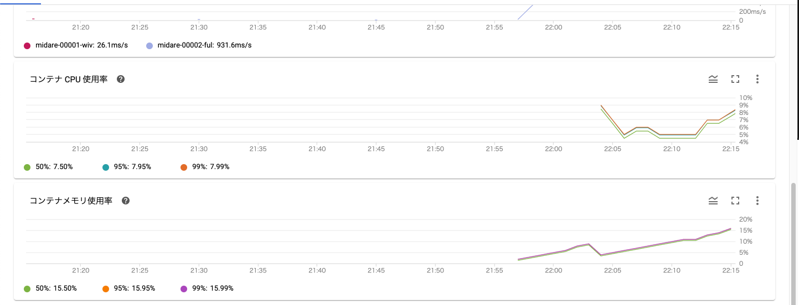

こんにちは、[@p1ass](https://twitter.com/p1ass)です。

この記事は、LT 会のために作った Web サービスが何故かバズって **Twitter トレンド 1 位** になってしまい、ひぃひぃ言いながら行った負荷対応をまとめたものになります。
スケーラビリティを全く考慮していない LT 会用の雑な Web サービスを、どのように改善していったのかについてまとめることで、個人開発者の参考になれば良いなと思っています。

なお、ここで書かれている内容は Production Ready なサービスを作る上では当たり前なことがほとんどです。本当の高負荷トラフィックを裁くための知見は出てこないので、予めご了承ください。

<!--more-->

## 作った Web サービス「生活習慣の乱れを可視化するやつ」

最初に作った Web サービスを紹介しておきます。「生活習慣の乱れを可視化するやつ」という Web サービスを作りました。



このアプリは Twitter API を使ってツイートを解析し、カレンダー UI で直感的に起きている時間を把握することが出来るアプリです。本来は生活習慣の乱れを可視化するために作ったのですが、実態としては **「ツイ廃可視化アプリ」** なので、多くの人が Twitter ばっか開いている現実を目の当たりにしたようです。

また、いくつかのネットメディアにも Web サービスを掲載していただきました。[^a]

[^a]: お願いしたわけではない





ソースコードは GitHub で全て公開してあるので、興味のある方は是非ご覧ください。Go x React で書いてます。



## 負荷対応記録

さて、ここからが本題になります。ここでは、サービス公開から Twitter トレンド 1 位になるまでに行った負荷対応を時系列で紹介していきます。

### 20:00 LT 会に登壇する

冒頭で書いたとおり、このアプリは LT 会のために作ったものです。友人の誕生日 LT 会でこのアプリに関する登壇をしました。

### 20:30 LT 会を聞きつつアナリティクスを見たら、アクティブユーザが結構いてビビる

無事登壇も終了し、のんきに酒を飲みながら LT 会を聞いていたのですが、ふと気になり Google Analytics を開くと、アクティブユーザが 100 人を超えていてビビります。



また、このあたりで RT 数が 100 を超え始め、ちょっと焦り始めます。

この 30 分後にはアクティブユーザが 400 人を超えました。

### 21:00 VPS の Grafana のアラートがなる

そうこうしているうちに API サーバを立てている VPS のアラートが鳴り始めました。

_プロセスがリスポーンを繰り返している様子 (上)CPU 使用率 (下)メモリ使用率_

ここで、この時点におけるインフラアーキテクチャについて軽く説明しておきます。フロントエンドは Netlify でホスティング、API サーバは ConoHa の VPS(CPU1 コア、メモリ 512MB)を利用してしました。また、API サーバは Docker で立ち上げていました。フロントエンドは落ちる心配はないが、API はすぐ落ちる可能性がある、という状況でした。

また、LT 会用に作った雑実装で**ログインセッションをオンメモリで持っていたため、単純にスケールアウトすることは出来ません。**

このタイミングで「さすがに負荷対応しないとマズイ」と考え、今より性能の良いインスタンスをすぐ使えるクラウドに移行し、その後スケールアウトできるようにアプリケーションコードを書き換えることを決意しました。

### 21:10 Cloud Run へ移行を始める

クラウドに移行すると決めたので、どのサービスを使うか検討し始めます。

まず、クラウドベンダは日常的に使い慣れている GCP にすることにしました。次に、どのサービスを利用するか考えるのですが、VPS で動かしていることを考えると GCE が 1 番移行が簡単そうでした。しかし、スケーラブルなアーキテクチャを作るには時間がかかると判断し、GCE は断念しました。その他のいくつかのマネージドサービスを検討したのですが、

- 簡単にスケールアウトができる
- Docker イメージをそのまま使える
- 業務で使っている

という理由から、**Cloud Run** を使うことにしました。

GCP には GAE もありますが、GAE 用のコンフィグを準備やローカル開発サーバの準備に時間がかかります。1 分でも早く移行したいと考え、今回は選択しませんでした。

なお、先程書いた通りスケールアウトはできないので、現時点では最大インスタンス数を 1 に設定してバグらないようにします。

### 補足: Cloud Run の最小インスタンス数について

知っている方は知っているかと思いますが、**Cloud Run の最小インスタンス数は 0 です。つまり、コンテナが全て止まる可能性があります。** 全てのコンテナが止まると、オンメモリで持っているログインセッション情報が全て飛ぶので、ログインセッションを維持できなくなります。

しかし、現状のリクエスト数を見る限り、インスタンス数が 0 になることはないだろうと考え、リクエストが落ち着く前に、ログインセッションの保持を API サーバから切り離すことにしました。

### 22:00 Cloud Run への移行が完了する

一時間弱で Cloud Run への移行が完了しました。



_移行直後のメトリクス_

### 22:20 ツイート情報のキャッシュの Expire を短くする

移行直後のメトリクスを見ればわかるように、メモリ使用率がどんどん上昇しています。これはツイート情報をオンメモリでキャッシュしているのが要因です。

起きている時間を返す API は、レスポンスが遅い (1 リクエストで数百 ms かかる) Twitter API を直列で複数回叩く必要があるため、**API 全体では 1~2 秒ほどかかります。** ブラウザをリロードするたびにそんな API をコールするのは辛いです。そこで、ツイート情報をオンメモリでキャッシュし、 30 分間は何回 API をコールしても同じレスポンスを返すようにしていました。[^1]

[^1]: 30 分はカレンダーの時間分解能

しかし、このままだとサービスのユーザ数が多くなればなるほどメモリを圧迫し、メモリを食い尽くす可能性がありました。

Google Analytics を見ると平均セッション維持時間は数分であり、30 分もキャッシュしておく必要がなさそうだったので、キャッシュの Expire を 10 分まで短くし、なるべくメモリを開放するようにしました。

_メモリ使用率 (後に Expire を 5 分に設定し直した)_

## 22:20 アクティブユーザが 2000 人を超える

キャッシュの実装が終わったころには、アクティブユーザが 2000 人を超えていました。



この数字に懐疑的だったので、後日色々メトリクスを調べてみたのですが、API レスポンスが非常に遅くなってレスポンス待ちのユーザが多く発生したため、アクティブユーザが多くなっていたようです。

### 22:30 Twitter API の Rate Limit にあたる

サーバが死にました。



原因は Twitter API の Rate Limit でした。Twitter API の User Timeline を取得する API は Twitter アプリ 1 つにつき 100,000 リクエスト/日という制限があり、これに引っかかってしまいました。

> Important notice: On June 19, 2019, we began enforcing a limit of 100,000 requests per day to the /statuses/user_timeline endpoint, in addition to existing user-level and app-level rate limits.



応急処置として新たに Twitter アプリを作成し、トークンを差し替えることにしました。

**注意及び免責**

**当時は知りませんでしたが、同一のソフトウェアで複数の Twitter アプリを作成することは禁止されています。この制限に気づいてから複数の Twitter アプリを利用するのはやめ、現在は 1 つの Twitter アプリのみを利用しています。この記事では注意喚起の意味を込めて紹介しており、読者が複数の Twitter アプリを作成したとしても、一切の責任を負いません。**

> You may not register multiple applications for a single use case or substantially similar or overlapping use cases. In this context, a “use case” is a consistent set of analyses, displays, or actions performed via an application. Please note that providing the same service or application to different people (including “white label” versions of a tool or service) counts as a single use case.



### 23:05 ログインセッションを Redis に移す

Cloud Run で動く API サーバのスケールアウトを可能にするために、Cloud Run とは別に、ログインセッションを保存する Redis のインスタンスを立ち上げました。これにより、API サーバのスケールアウトが可能になりました。

### 23:20 ログイン処理がバグってることに気づく



コンビニから返ってきたら、ログイン処理がおかしいという報告が来ていました。調査してみると、Redis に移すべきオンメモリの情報を一部移し忘れていました。そのため、ログインが 1/n の確率で成功する状態になっていました 😇

### 24:30 Cloud Monitoring のアラート設定を沢山する

寝ても大丈夫なようにアラートをガンガン設定しました。

### 25:00 Twitter トレンド１位になる

プリコネ[^2]や #cheeruphanabi を抑えて Twitter トレンド 1 位になりました 🎉



[^2]: コッコロたん〜〜〜

### 深夜 色々微調整を行う

キャッシュの間隔調整や細かいバグつぶしなどを沢山しました。

### 29:00 (朝の 5 時) 寝る

これにて当日の対応は終了です。寝ました。

## 最終的なリクエスト数

リリース日の PV は 11 万、次の日は 30 万でした。その後は指数関数的に減っていき、今では最大リクエスト数の 1%もありません。

## 急な負荷対応をしてみて思ったこと

当たり前ですが、**「最初からスケーラブルな設計にしておくこと」** はとても大事だと実感しました。少なくともログインセッションを Redis や MySQL に最初から持っていたら、対応はもっと楽だったでしょう。個人開発だからと手を抜くと痛い目に会います。

また、**「テストを書いていなかったこと」** を非常に後悔しています。普段はテストを書いているのですが、今回は書いていませんでした。負荷対応で焦ってコードを直しているとバグを埋め込みがちで、デバッグにとても苦労しました。デバッグしながら、「あぁ、なんで俺はテストを書かなかったんだ...」とぼやいていました。

## その他のアーキテクチャ選択肢

今回はログインセッションのストアを切り出してスケールアウトに対応しましたが、**ログイン処理をまるごと切り出す** という方法でもスケールアウトには対応できたと思います。[^isucon]具体的には、VPS ではログイン処理のみを行い、アプリケーションロジックは Cloud Run で行うようにします。ログイン処理よりもアプリケーションロジックの方が支配的なこの Web サービスにおいては、１つの選択肢になりえると思います。

[^isucon]: ISUCON9 の予選を解いてたら思いついた。いわゆるログインサーバ

この方法の良いところは、オンメモリでログインセッションを持ったままでよいことです。Redis などを準備する必要がないので、インフラの設定時間を短縮できます。しかし、この方法を実装するには、アプリケーションのコードを多く書き換える必要があり、テストのないアプリケーションで急いで行うには少々リスキーです。このトレードオフを考えると、今回の Redis を使ったスケールアウト戦略は妥当だったかなと思っています。[^時間]

[^時間]: 勿論時間をかけて検討する場合はこの限りではない

## さいごに

今回の対応で **「当たり前のことを当たり前にやる」ことの重要性** を痛感しました。当たり前のことをやった上での障害は仕方ないですが、当たり前のことを行っていないマイナスの状態からの対応は結構苦痛でした。今回は趣味開発だったので良かったですが、これが仕事だと思うとゾッとします。これからは趣味でも当たり前のことを当たり前にやっていきたいです。

この記事が皆さんに役に立てば幸いです。

## P.S.

この対応で僕の生活習慣が乱れました。どうしてくれるんですか？？

## おまけ






